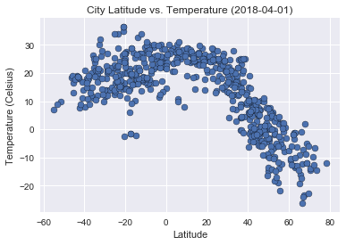
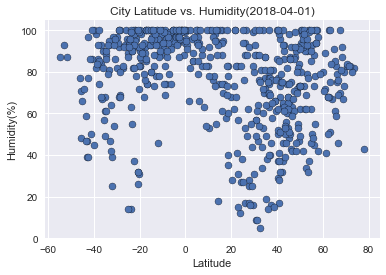
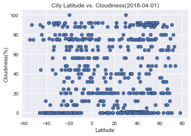
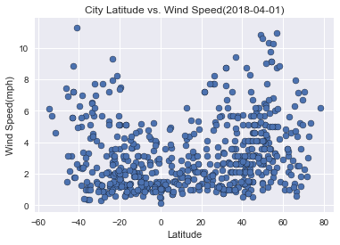

WeatherPy
============
------------
## Analysis

- Temperatures tends to be higher as latitude get closer to the equator.
- There is no correlation between the cloudiness and the distance from the equator.
- Humidity seems to be higher nearby the equator, specially in the southern region.


```python
#Dependencies
import pandas as pd
import numpy as np
import json
import requests
import random
import matplotlib.pyplot as plt
import seaborn as sb
from datetime import date
from citipy import citipy

#Config
from config import api_key
```

## Generate Coordinates List


```python
#Lists to store values
long = []
lat = []
coordinates = []

#Loops to populate coordinates list with random values for lat and long, covering all regions of the world.

#North America
for c1 in range (0,250):
    dec_long = random.random()/10
    dec_lat = random.random()/10
    long.append(round(float(random.randint(-120,-60)+dec_long),3))
    lat.append(round(float(random.randint(15,70)+dec_lat),3))
    
#Europe, Asia, Northern Africa
for c2 in range (0,250):
    dec_long = random.random()/10
    dec_lat = random.random()/10
    long.append(round(float(random.randint(-15,150)+dec_long),3))
    lat.append(round(float(random.randint(0,75)+dec_lat),3))

#Central and South America
for c3 in range (0,250):
    dec_long = random.random()/10
    dec_lat = random.random()/10
    long.append(round(float(random.randint(-90,-60)+dec_long),3))
    lat.append(round(float(random.randint(-60,-15)+dec_lat),3))

#Africa
for c4 in range (0,250):
    dec_long = random.random()/10
    dec_lat = random.random()/10
    long.append(round(float(random.randint(0,60)+dec_long),3))
    lat.append(round(float(random.randint(-30,0)+dec_lat),3))

#South East Asia and Oceania
for c5 in range (0,150):
    dec_long = random.random()/10
    dec_lat = random.random()/10
    long.append(round(float(random.randint(105,180)+dec_long),3))
    lat.append(round(float(random.randint(-60,0)+dec_lat),3))

#Populate all lat and long values on the coordinates list
for x in range (0,len(lat)):
    coordinates.append([lat[x], long[x]]) 
```

## Generate Cities List


```python
#List to store city names
cities = []

#Loop to populate cities list with city names
for coordinate_pair in coordinates:
    lat, lon = coordinate_pair
    name = citipy.nearest_city(lat, lon) 
    cities.append(name)

#Remove Duplicates
cities = list(set(cities))

#Count of unique cities in our list
len(cities)
```


    651


## Perform API Calls


```python
#Variables values
url = "http://api.openweathermap.org/data/2.5/weather?"
units = "metric"

#Lists to store reponse info
lat = []
temp = []
name = []
humid = []
clouds = []
wind = []

#Initial print for our Data Retrieval process
print("Beginning Data Retrieval")
print("-----------------------------")

#Counter for the processed records
count = 1

#Loop to retrieve all the information required from the Weather API
for city in cities:
    query_url = f"{url}appid={api_key}&units={units}&q="
    # Get weather data
    response = requests.get(query_url+city.city_name).json()
    try:
        #Required information stored in a variable
        cname = response['name']
        ctemp = response['main']['temp']
        clat = response['coord']['lat']
        chum = response['main']['humidity']
        ccld = response['clouds']['all']
        cwnd = response['wind']['speed'] 
        #Values stored in their respective list
        lat.append(clat)
        temp.append(ctemp)
        name.append(cname)
        humid.append(chum)
        clouds.append(ccld)
        wind.append(cwnd)
        #Replace spaces in the city name to show proper URL
        name_print = cname.replace(" ","%20")
        #Print log information to validate data retrieval process
        print(f"Processing Record {count} | {cname}") 
        print(f"{query_url}&q={name_print}")
        #Increase count for the next record
        count = count + 1
    #Error handling for Key Errors
    except KeyError:
        print("City not found. Skipping...")
        continue
        
#Final print for our Data Retrieval process
print("-------------------------")
print("Data Retrieval Complete")
print("-------------------------")
print(str(len(name))+ " cities were processed.")  
```

    Beginning Data Retrieval
    -----------------------------
    Processing Record 1 | Kirakira
    http://api.openweathermap.org/data/2.5/weather?appid=7024b31d48990ee20b063c59ef315042&units=metric&q=&q=Kirakira
    Processing Record 2 | Alice Springs
    http://api.openweathermap.org/data/2.5/weather?appid=7024b31d48990ee20b063c59ef315042&units=metric&q=&q=Alice%20Springs
    Processing Record 3 | Matamoros
    http://api.openweathermap.org/data/2.5/weather?appid=7024b31d48990ee20b063c59ef315042&units=metric&q=&q=Matamoros
    Processing Record 4 | Chernyshevskiy
    http://api.openweathermap.org/data/2.5/weather?appid=7024b31d48990ee20b063c59ef315042&units=metric&q=&q=Chernyshevskiy
    Processing Record 5 | Tessalit
    http://api.openweathermap.org/data/2.5/weather?appid=7024b31d48990ee20b063c59ef315042&units=metric&q=&q=Tessalit
    Processing Record 6 | Walla Walla
    http://api.openweathermap.org/data/2.5/weather?appid=7024b31d48990ee20b063c59ef315042&units=metric&q=&q=Walla%20Walla
    Processing Record 7 | Mookane
    http://api.openweathermap.org/data/2.5/weather?appid=7024b31d48990ee20b063c59ef315042&units=metric&q=&q=Mookane
    Processing Record 8 | Alyangula
    http://api.openweathermap.org/data/2.5/weather?appid=7024b31d48990ee20b063c59ef315042&units=metric&q=&q=Alyangula
    Processing Record 9 | Lata
    http://api.openweathermap.org/data/2.5/weather?appid=7024b31d48990ee20b063c59ef315042&units=metric&q=&q=Lata
    Processing Record 10 | Dandong
    http://api.openweathermap.org/data/2.5/weather?appid=7024b31d48990ee20b063c59ef315042&units=metric&q=&q=Dandong
    City not found. Skipping...
    Processing Record 11 | Ngorongoro
    http://api.openweathermap.org/data/2.5/weather?appid=7024b31d48990ee20b063c59ef315042&units=metric&q=&q=Ngorongoro
    Processing Record 12 | Tshikapa
    http://api.openweathermap.org/data/2.5/weather?appid=7024b31d48990ee20b063c59ef315042&units=metric&q=&q=Tshikapa
    Processing Record 13 | Roald
    http://api.openweathermap.org/data/2.5/weather?appid=7024b31d48990ee20b063c59ef315042&units=metric&q=&q=Roald
    Processing Record 14 | Victoria
    http://api.openweathermap.org/data/2.5/weather?appid=7024b31d48990ee20b063c59ef315042&units=metric&q=&q=Victoria
    City not found. Skipping...
    Processing Record 15 | Praya
    http://api.openweathermap.org/data/2.5/weather?appid=7024b31d48990ee20b063c59ef315042&units=metric&q=&q=Praya
    City not found. Skipping...
    City not found. Skipping...
    Processing Record 16 | Fredericton
    http://api.openweathermap.org/data/2.5/weather?appid=7024b31d48990ee20b063c59ef315042&units=metric&q=&q=Fredericton
    Processing Record 17 | Micheweni
    http://api.openweathermap.org/data/2.5/weather?appid=7024b31d48990ee20b063c59ef315042&units=metric&q=&q=Micheweni
    Processing Record 18 | Mantua
    http://api.openweathermap.org/data/2.5/weather?appid=7024b31d48990ee20b063c59ef315042&units=metric&q=&q=Mantua
    Processing Record 19 | Magistralnyy
    http://api.openweathermap.org/data/2.5/weather?appid=7024b31d48990ee20b063c59ef315042&units=metric&q=&q=Magistralnyy
    Processing Record 20 | Mocuba
    http://api.openweathermap.org/data/2.5/weather?appid=7024b31d48990ee20b063c59ef315042&units=metric&q=&q=Mocuba
    City not found. Skipping...
    Processing Record 21 | Montepuez
    http://api.openweathermap.org/data/2.5/weather?appid=7024b31d48990ee20b063c59ef315042&units=metric&q=&q=Montepuez
    Processing Record 22 | Havre-Saint-Pierre
    http://api.openweathermap.org/data/2.5/weather?appid=7024b31d48990ee20b063c59ef315042&units=metric&q=&q=Havre-Saint-Pierre
    City not found. Skipping...
    Processing Record 23 | Arawa
    http://api.openweathermap.org/data/2.5/weather?appid=7024b31d48990ee20b063c59ef315042&units=metric&q=&q=Arawa
    Processing Record 24 | Novikovo
    http://api.openweathermap.org/data/2.5/weather?appid=7024b31d48990ee20b063c59ef315042&units=metric&q=&q=Novikovo
    Processing Record 25 | Jiangyou
    http://api.openweathermap.org/data/2.5/weather?appid=7024b31d48990ee20b063c59ef315042&units=metric&q=&q=Jiangyou
    Processing Record 26 | Ormstown
    http://api.openweathermap.org/data/2.5/weather?appid=7024b31d48990ee20b063c59ef315042&units=metric&q=&q=Ormstown
    Processing Record 27 | Lindi
    http://api.openweathermap.org/data/2.5/weather?appid=7024b31d48990ee20b063c59ef315042&units=metric&q=&q=Lindi
    Processing Record 28 | Hay River
    http://api.openweathermap.org/data/2.5/weather?appid=7024b31d48990ee20b063c59ef315042&units=metric&q=&q=Hay%20River
    City not found. Skipping...
    Processing Record 29 | Nampula
    http://api.openweathermap.org/data/2.5/weather?appid=7024b31d48990ee20b063c59ef315042&units=metric&q=&q=Nampula
    Processing Record 30 | Ust-Ilimsk
    http://api.openweathermap.org/data/2.5/weather?appid=7024b31d48990ee20b063c59ef315042&units=metric&q=&q=Ust-Ilimsk
    City not found. Skipping...
    City not found. Skipping...
    Processing Record 31 | Herat
    http://api.openweathermap.org/data/2.5/weather?appid=7024b31d48990ee20b063c59ef315042&units=metric&q=&q=Herat
    Processing Record 32 | Ballina
    http://api.openweathermap.org/data/2.5/weather?appid=7024b31d48990ee20b063c59ef315042&units=metric&q=&q=Ballina
    Processing Record 33 | Bloemfontein
    http://api.openweathermap.org/data/2.5/weather?appid=7024b31d48990ee20b063c59ef315042&units=metric&q=&q=Bloemfontein
    Processing Record 34 | Gillette
    http://api.openweathermap.org/data/2.5/weather?appid=7024b31d48990ee20b063c59ef315042&units=metric&q=&q=Gillette
    Processing Record 35 | Quelimane
    http://api.openweathermap.org/data/2.5/weather?appid=7024b31d48990ee20b063c59ef315042&units=metric&q=&q=Quelimane
    Processing Record 36 | Batemans Bay
    http://api.openweathermap.org/data/2.5/weather?appid=7024b31d48990ee20b063c59ef315042&units=metric&q=&q=Batemans%20Bay
    Processing Record 37 | Muzhi
    http://api.openweathermap.org/data/2.5/weather?appid=7024b31d48990ee20b063c59ef315042&units=metric&q=&q=Muzhi
    Processing Record 38 | Butembo
    http://api.openweathermap.org/data/2.5/weather?appid=7024b31d48990ee20b063c59ef315042&units=metric&q=&q=Butembo
    Processing Record 39 | Mount Gambier
    http://api.openweathermap.org/data/2.5/weather?appid=7024b31d48990ee20b063c59ef315042&units=metric&q=&q=Mount%20Gambier
    Processing Record 40 | Ilo
    http://api.openweathermap.org/data/2.5/weather?appid=7024b31d48990ee20b063c59ef315042&units=metric&q=&q=Ilo
    Processing Record 41 | Lhokseumawe
    http://api.openweathermap.org/data/2.5/weather?appid=7024b31d48990ee20b063c59ef315042&units=metric&q=&q=Lhokseumawe
    Processing Record 42 | Mount Isa
    http://api.openweathermap.org/data/2.5/weather?appid=7024b31d48990ee20b063c59ef315042&units=metric&q=&q=Mount%20Isa
    Processing Record 43 | Ranong
    http://api.openweathermap.org/data/2.5/weather?appid=7024b31d48990ee20b063c59ef315042&units=metric&q=&q=Ranong
    Processing Record 44 | Ahipara
    http://api.openweathermap.org/data/2.5/weather?appid=7024b31d48990ee20b063c59ef315042&units=metric&q=&q=Ahipara
    Processing Record 45 | Chapais
    http://api.openweathermap.org/data/2.5/weather?appid=7024b31d48990ee20b063c59ef315042&units=metric&q=&q=Chapais
    Processing Record 46 | Newnan
    http://api.openweathermap.org/data/2.5/weather?appid=7024b31d48990ee20b063c59ef315042&units=metric&q=&q=Newnan
    Processing Record 47 | Rebrikha
    http://api.openweathermap.org/data/2.5/weather?appid=7024b31d48990ee20b063c59ef315042&units=metric&q=&q=Rebrikha
    City not found. Skipping...
    Processing Record 48 | Mlowo
    http://api.openweathermap.org/data/2.5/weather?appid=7024b31d48990ee20b063c59ef315042&units=metric&q=&q=Mlowo
    Processing Record 49 | Melita
    http://api.openweathermap.org/data/2.5/weather?appid=7024b31d48990ee20b063c59ef315042&units=metric&q=&q=Melita
    Processing Record 50 | Bajos de Haina
    http://api.openweathermap.org/data/2.5/weather?appid=7024b31d48990ee20b063c59ef315042&units=metric&q=&q=Bajos%20de%20Haina
    Processing Record 51 | Bombay
    http://api.openweathermap.org/data/2.5/weather?appid=7024b31d48990ee20b063c59ef315042&units=metric&q=&q=Bombay
    Processing Record 52 | Hudson Bay
    http://api.openweathermap.org/data/2.5/weather?appid=7024b31d48990ee20b063c59ef315042&units=metric&q=&q=Hudson%20Bay
    Processing Record 53 | Chase
    http://api.openweathermap.org/data/2.5/weather?appid=7024b31d48990ee20b063c59ef315042&units=metric&q=&q=Chase
    Processing Record 54 | Vostok
    http://api.openweathermap.org/data/2.5/weather?appid=7024b31d48990ee20b063c59ef315042&units=metric&q=&q=Vostok
    Processing Record 55 | Oktyabrskoye
    http://api.openweathermap.org/data/2.5/weather?appid=7024b31d48990ee20b063c59ef315042&units=metric&q=&q=Oktyabrskoye
    Processing Record 56 | Klyuchi
    http://api.openweathermap.org/data/2.5/weather?appid=7024b31d48990ee20b063c59ef315042&units=metric&q=&q=Klyuchi
    Processing Record 57 | Isangel
    http://api.openweathermap.org/data/2.5/weather?appid=7024b31d48990ee20b063c59ef315042&units=metric&q=&q=Isangel
    Processing Record 58 | Florence
    http://api.openweathermap.org/data/2.5/weather?appid=7024b31d48990ee20b063c59ef315042&units=metric&q=&q=Florence
    City not found. Skipping...
    Processing Record 59 | Rudnaya Pristan
    http://api.openweathermap.org/data/2.5/weather?appid=7024b31d48990ee20b063c59ef315042&units=metric&q=&q=Rudnaya%20Pristan
    Processing Record 60 | Kichmengskiy Gorodok
    http://api.openweathermap.org/data/2.5/weather?appid=7024b31d48990ee20b063c59ef315042&units=metric&q=&q=Kichmengskiy%20Gorodok
    Processing Record 61 | Grootfontein
    http://api.openweathermap.org/data/2.5/weather?appid=7024b31d48990ee20b063c59ef315042&units=metric&q=&q=Grootfontein
    Processing Record 62 | Pangnirtung
    http://api.openweathermap.org/data/2.5/weather?appid=7024b31d48990ee20b063c59ef315042&units=metric&q=&q=Pangnirtung
    Processing Record 63 | Mpanda
    http://api.openweathermap.org/data/2.5/weather?appid=7024b31d48990ee20b063c59ef315042&units=metric&q=&q=Mpanda
    Processing Record 64 | Broken Hill
    http://api.openweathermap.org/data/2.5/weather?appid=7024b31d48990ee20b063c59ef315042&units=metric&q=&q=Broken%20Hill
    Processing Record 65 | Bluff
    http://api.openweathermap.org/data/2.5/weather?appid=7024b31d48990ee20b063c59ef315042&units=metric&q=&q=Bluff
    Processing Record 66 | Henties Bay
    http://api.openweathermap.org/data/2.5/weather?appid=7024b31d48990ee20b063c59ef315042&units=metric&q=&q=Henties%20Bay
    Processing Record 67 | Kieta
    http://api.openweathermap.org/data/2.5/weather?appid=7024b31d48990ee20b063c59ef315042&units=metric&q=&q=Kieta
    Processing Record 68 | Sangar
    http://api.openweathermap.org/data/2.5/weather?appid=7024b31d48990ee20b063c59ef315042&units=metric&q=&q=Sangar
    Processing Record 69 | Mafeteng
    http://api.openweathermap.org/data/2.5/weather?appid=7024b31d48990ee20b063c59ef315042&units=metric&q=&q=Mafeteng
    Processing Record 70 | Middleton
    http://api.openweathermap.org/data/2.5/weather?appid=7024b31d48990ee20b063c59ef315042&units=metric&q=&q=Middleton
    Processing Record 71 | Chokurdakh
    http://api.openweathermap.org/data/2.5/weather?appid=7024b31d48990ee20b063c59ef315042&units=metric&q=&q=Chokurdakh
    Processing Record 72 | Broome
    http://api.openweathermap.org/data/2.5/weather?appid=7024b31d48990ee20b063c59ef315042&units=metric&q=&q=Broome
    Processing Record 73 | Kiunga
    http://api.openweathermap.org/data/2.5/weather?appid=7024b31d48990ee20b063c59ef315042&units=metric&q=&q=Kiunga
    Processing Record 74 | Nuevo Progreso
    http://api.openweathermap.org/data/2.5/weather?appid=7024b31d48990ee20b063c59ef315042&units=metric&q=&q=Nuevo%20Progreso
    City not found. Skipping...
    Processing Record 75 | San Borja
    http://api.openweathermap.org/data/2.5/weather?appid=7024b31d48990ee20b063c59ef315042&units=metric&q=&q=San%20Borja
    Processing Record 76 | Geraldton
    http://api.openweathermap.org/data/2.5/weather?appid=7024b31d48990ee20b063c59ef315042&units=metric&q=&q=Geraldton
    Processing Record 77 | Hohhot
    http://api.openweathermap.org/data/2.5/weather?appid=7024b31d48990ee20b063c59ef315042&units=metric&q=&q=Hohhot
    Processing Record 78 | Krasnoarmeysk
    http://api.openweathermap.org/data/2.5/weather?appid=7024b31d48990ee20b063c59ef315042&units=metric&q=&q=Krasnoarmeysk
    Processing Record 79 | Bin Qirdan
    http://api.openweathermap.org/data/2.5/weather?appid=7024b31d48990ee20b063c59ef315042&units=metric&q=&q=Bin%20Qirdan
    Processing Record 80 | Turukhansk
    http://api.openweathermap.org/data/2.5/weather?appid=7024b31d48990ee20b063c59ef315042&units=metric&q=&q=Turukhansk
    Processing Record 81 | San Quintin
    http://api.openweathermap.org/data/2.5/weather?appid=7024b31d48990ee20b063c59ef315042&units=metric&q=&q=San%20Quintin
    Processing Record 82 | Guaymas
    http://api.openweathermap.org/data/2.5/weather?appid=7024b31d48990ee20b063c59ef315042&units=metric&q=&q=Guaymas
    Processing Record 83 | Te Anau
    http://api.openweathermap.org/data/2.5/weather?appid=7024b31d48990ee20b063c59ef315042&units=metric&q=&q=Te%20Anau
    Processing Record 84 | Colonial Heights
    http://api.openweathermap.org/data/2.5/weather?appid=7024b31d48990ee20b063c59ef315042&units=metric&q=&q=Colonial%20Heights
    Processing Record 85 | Varhaug
    http://api.openweathermap.org/data/2.5/weather?appid=7024b31d48990ee20b063c59ef315042&units=metric&q=&q=Varhaug
    Processing Record 86 | Pitiquito
    http://api.openweathermap.org/data/2.5/weather?appid=7024b31d48990ee20b063c59ef315042&units=metric&q=&q=Pitiquito
    Processing Record 87 | Elizabeth City
    http://api.openweathermap.org/data/2.5/weather?appid=7024b31d48990ee20b063c59ef315042&units=metric&q=&q=Elizabeth%20City
    City not found. Skipping...
    Processing Record 88 | Castro
    http://api.openweathermap.org/data/2.5/weather?appid=7024b31d48990ee20b063c59ef315042&units=metric&q=&q=Castro
    Processing Record 89 | Christchurch
    http://api.openweathermap.org/data/2.5/weather?appid=7024b31d48990ee20b063c59ef315042&units=metric&q=&q=Christchurch
    Processing Record 90 | Guerrero Negro
    http://api.openweathermap.org/data/2.5/weather?appid=7024b31d48990ee20b063c59ef315042&units=metric&q=&q=Guerrero%20Negro
    Processing Record 91 | Mason City
    http://api.openweathermap.org/data/2.5/weather?appid=7024b31d48990ee20b063c59ef315042&units=metric&q=&q=Mason%20City
    Processing Record 92 | Cauquenes
    http://api.openweathermap.org/data/2.5/weather?appid=7024b31d48990ee20b063c59ef315042&units=metric&q=&q=Cauquenes
    Processing Record 93 | Warren
    http://api.openweathermap.org/data/2.5/weather?appid=7024b31d48990ee20b063c59ef315042&units=metric&q=&q=Warren
    Processing Record 94 | Kota Kinabalu
    http://api.openweathermap.org/data/2.5/weather?appid=7024b31d48990ee20b063c59ef315042&units=metric&q=&q=Kota%20Kinabalu
    Processing Record 95 | Phalaborwa
    http://api.openweathermap.org/data/2.5/weather?appid=7024b31d48990ee20b063c59ef315042&units=metric&q=&q=Phalaborwa
    Processing Record 96 | Gampaha
    http://api.openweathermap.org/data/2.5/weather?appid=7024b31d48990ee20b063c59ef315042&units=metric&q=&q=Gampaha
    Processing Record 97 | La Ronge
    http://api.openweathermap.org/data/2.5/weather?appid=7024b31d48990ee20b063c59ef315042&units=metric&q=&q=La%20Ronge
    Processing Record 98 | Casas Grandes
    http://api.openweathermap.org/data/2.5/weather?appid=7024b31d48990ee20b063c59ef315042&units=metric&q=&q=Casas%20Grandes
    Processing Record 99 | Panikian
    http://api.openweathermap.org/data/2.5/weather?appid=7024b31d48990ee20b063c59ef315042&units=metric&q=&q=Panikian
    Processing Record 100 | Loveland
    http://api.openweathermap.org/data/2.5/weather?appid=7024b31d48990ee20b063c59ef315042&units=metric&q=&q=Loveland
    Processing Record 101 | Savannah Bight
    http://api.openweathermap.org/data/2.5/weather?appid=7024b31d48990ee20b063c59ef315042&units=metric&q=&q=Savannah%20Bight
    Processing Record 102 | Salalah
    http://api.openweathermap.org/data/2.5/weather?appid=7024b31d48990ee20b063c59ef315042&units=metric&q=&q=Salalah
    Processing Record 103 | Coihaique
    http://api.openweathermap.org/data/2.5/weather?appid=7024b31d48990ee20b063c59ef315042&units=metric&q=&q=Coihaique
    Processing Record 104 | Kulu
    http://api.openweathermap.org/data/2.5/weather?appid=7024b31d48990ee20b063c59ef315042&units=metric&q=&q=Kulu
    Processing Record 105 | Pochutla
    http://api.openweathermap.org/data/2.5/weather?appid=7024b31d48990ee20b063c59ef315042&units=metric&q=&q=Pochutla
    Processing Record 106 | Dikson
    http://api.openweathermap.org/data/2.5/weather?appid=7024b31d48990ee20b063c59ef315042&units=metric&q=&q=Dikson
    Processing Record 107 | Sur
    http://api.openweathermap.org/data/2.5/weather?appid=7024b31d48990ee20b063c59ef315042&units=metric&q=&q=Sur
    Processing Record 108 | Kristiansund
    http://api.openweathermap.org/data/2.5/weather?appid=7024b31d48990ee20b063c59ef315042&units=metric&q=&q=Kristiansund
    Processing Record 109 | Kavaratti
    http://api.openweathermap.org/data/2.5/weather?appid=7024b31d48990ee20b063c59ef315042&units=metric&q=&q=Kavaratti
    Processing Record 110 | Baruun-Urt
    http://api.openweathermap.org/data/2.5/weather?appid=7024b31d48990ee20b063c59ef315042&units=metric&q=&q=Baruun-Urt
    Processing Record 111 | Spas-Klepiki
    http://api.openweathermap.org/data/2.5/weather?appid=7024b31d48990ee20b063c59ef315042&units=metric&q=&q=Spas-Klepiki
    Processing Record 112 | Constantine
    http://api.openweathermap.org/data/2.5/weather?appid=7024b31d48990ee20b063c59ef315042&units=metric&q=&q=Constantine
    Processing Record 113 | Villa Union
    http://api.openweathermap.org/data/2.5/weather?appid=7024b31d48990ee20b063c59ef315042&units=metric&q=&q=Villa%20Union
    Processing Record 114 | Hobart
    http://api.openweathermap.org/data/2.5/weather?appid=7024b31d48990ee20b063c59ef315042&units=metric&q=&q=Hobart
    Processing Record 115 | Durant
    http://api.openweathermap.org/data/2.5/weather?appid=7024b31d48990ee20b063c59ef315042&units=metric&q=&q=Durant
    Processing Record 116 | Millau
    http://api.openweathermap.org/data/2.5/weather?appid=7024b31d48990ee20b063c59ef315042&units=metric&q=&q=Millau
    Processing Record 117 | Redlands
    http://api.openweathermap.org/data/2.5/weather?appid=7024b31d48990ee20b063c59ef315042&units=metric&q=&q=Redlands
    Processing Record 118 | Hervey Bay
    http://api.openweathermap.org/data/2.5/weather?appid=7024b31d48990ee20b063c59ef315042&units=metric&q=&q=Hervey%20Bay
    Processing Record 119 | Potam
    http://api.openweathermap.org/data/2.5/weather?appid=7024b31d48990ee20b063c59ef315042&units=metric&q=&q=Potam
    Processing Record 120 | Havelock
    http://api.openweathermap.org/data/2.5/weather?appid=7024b31d48990ee20b063c59ef315042&units=metric&q=&q=Havelock
    Processing Record 121 | Ebolowa
    http://api.openweathermap.org/data/2.5/weather?appid=7024b31d48990ee20b063c59ef315042&units=metric&q=&q=Ebolowa
    Processing Record 122 | Constitucion
    http://api.openweathermap.org/data/2.5/weather?appid=7024b31d48990ee20b063c59ef315042&units=metric&q=&q=Constitucion
    Processing Record 123 | Divnogorsk
    http://api.openweathermap.org/data/2.5/weather?appid=7024b31d48990ee20b063c59ef315042&units=metric&q=&q=Divnogorsk
    Processing Record 124 | Makambako
    http://api.openweathermap.org/data/2.5/weather?appid=7024b31d48990ee20b063c59ef315042&units=metric&q=&q=Makambako
    Processing Record 125 | Yumen
    http://api.openweathermap.org/data/2.5/weather?appid=7024b31d48990ee20b063c59ef315042&units=metric&q=&q=Yumen
    Processing Record 126 | Cap Malheureux
    http://api.openweathermap.org/data/2.5/weather?appid=7024b31d48990ee20b063c59ef315042&units=metric&q=&q=Cap%20Malheureux
    Processing Record 127 | Tuatapere
    http://api.openweathermap.org/data/2.5/weather?appid=7024b31d48990ee20b063c59ef315042&units=metric&q=&q=Tuatapere
    Processing Record 128 | West Odessa
    http://api.openweathermap.org/data/2.5/weather?appid=7024b31d48990ee20b063c59ef315042&units=metric&q=&q=West%20Odessa
    Processing Record 129 | Storforshei
    http://api.openweathermap.org/data/2.5/weather?appid=7024b31d48990ee20b063c59ef315042&units=metric&q=&q=Storforshei
    Processing Record 130 | Copiapo
    http://api.openweathermap.org/data/2.5/weather?appid=7024b31d48990ee20b063c59ef315042&units=metric&q=&q=Copiapo
    Processing Record 131 | Ballina
    http://api.openweathermap.org/data/2.5/weather?appid=7024b31d48990ee20b063c59ef315042&units=metric&q=&q=Ballina
    Processing Record 132 | Horsham
    http://api.openweathermap.org/data/2.5/weather?appid=7024b31d48990ee20b063c59ef315042&units=metric&q=&q=Horsham
    Processing Record 133 | Vasilyevskiy Mokh
    http://api.openweathermap.org/data/2.5/weather?appid=7024b31d48990ee20b063c59ef315042&units=metric&q=&q=Vasilyevskiy%20Mokh
    Processing Record 134 | Synya
    http://api.openweathermap.org/data/2.5/weather?appid=7024b31d48990ee20b063c59ef315042&units=metric&q=&q=Synya
    Processing Record 135 | Coquimbo
    http://api.openweathermap.org/data/2.5/weather?appid=7024b31d48990ee20b063c59ef315042&units=metric&q=&q=Coquimbo
    Processing Record 136 | Steamboat Springs
    http://api.openweathermap.org/data/2.5/weather?appid=7024b31d48990ee20b063c59ef315042&units=metric&q=&q=Steamboat%20Springs
    City not found. Skipping...
    Processing Record 137 | Exeter
    http://api.openweathermap.org/data/2.5/weather?appid=7024b31d48990ee20b063c59ef315042&units=metric&q=&q=Exeter
    Processing Record 138 | Luwingu
    http://api.openweathermap.org/data/2.5/weather?appid=7024b31d48990ee20b063c59ef315042&units=metric&q=&q=Luwingu
    Processing Record 139 | Kigali
    http://api.openweathermap.org/data/2.5/weather?appid=7024b31d48990ee20b063c59ef315042&units=metric&q=&q=Kigali
    Processing Record 140 | Mzimba
    http://api.openweathermap.org/data/2.5/weather?appid=7024b31d48990ee20b063c59ef315042&units=metric&q=&q=Mzimba
    Processing Record 141 | Tyubuk
    http://api.openweathermap.org/data/2.5/weather?appid=7024b31d48990ee20b063c59ef315042&units=metric&q=&q=Tyubuk
    Processing Record 142 | Garissa
    http://api.openweathermap.org/data/2.5/weather?appid=7024b31d48990ee20b063c59ef315042&units=metric&q=&q=Garissa
    Processing Record 143 | Enid
    http://api.openweathermap.org/data/2.5/weather?appid=7024b31d48990ee20b063c59ef315042&units=metric&q=&q=Enid
    Processing Record 144 | El Porvenir
    http://api.openweathermap.org/data/2.5/weather?appid=7024b31d48990ee20b063c59ef315042&units=metric&q=&q=El%20Porvenir
    Processing Record 145 | Kalmunai
    http://api.openweathermap.org/data/2.5/weather?appid=7024b31d48990ee20b063c59ef315042&units=metric&q=&q=Kalmunai
    Processing Record 146 | Tigzirt
    http://api.openweathermap.org/data/2.5/weather?appid=7024b31d48990ee20b063c59ef315042&units=metric&q=&q=Tigzirt
    Processing Record 147 | New Plymouth
    http://api.openweathermap.org/data/2.5/weather?appid=7024b31d48990ee20b063c59ef315042&units=metric&q=&q=New%20Plymouth
    Processing Record 148 | Khilok
    http://api.openweathermap.org/data/2.5/weather?appid=7024b31d48990ee20b063c59ef315042&units=metric&q=&q=Khilok
    Processing Record 149 | Kohlu
    http://api.openweathermap.org/data/2.5/weather?appid=7024b31d48990ee20b063c59ef315042&units=metric&q=&q=Kohlu
    Processing Record 150 | Chake Chake
    http://api.openweathermap.org/data/2.5/weather?appid=7024b31d48990ee20b063c59ef315042&units=metric&q=&q=Chake%20Chake
    Processing Record 151 | Guymon
    http://api.openweathermap.org/data/2.5/weather?appid=7024b31d48990ee20b063c59ef315042&units=metric&q=&q=Guymon
    Processing Record 152 | Progreso
    http://api.openweathermap.org/data/2.5/weather?appid=7024b31d48990ee20b063c59ef315042&units=metric&q=&q=Progreso
    City not found. Skipping...
    Processing Record 153 | Iralaya
    http://api.openweathermap.org/data/2.5/weather?appid=7024b31d48990ee20b063c59ef315042&units=metric&q=&q=Iralaya
    Processing Record 154 | Ntcheu
    http://api.openweathermap.org/data/2.5/weather?appid=7024b31d48990ee20b063c59ef315042&units=metric&q=&q=Ntcheu
    Processing Record 155 | Karratha
    http://api.openweathermap.org/data/2.5/weather?appid=7024b31d48990ee20b063c59ef315042&units=metric&q=&q=Karratha
    Processing Record 156 | Pangkalanbuun
    http://api.openweathermap.org/data/2.5/weather?appid=7024b31d48990ee20b063c59ef315042&units=metric&q=&q=Pangkalanbuun
    Processing Record 157 | Belaya Gora
    http://api.openweathermap.org/data/2.5/weather?appid=7024b31d48990ee20b063c59ef315042&units=metric&q=&q=Belaya%20Gora
    City not found. Skipping...
    Processing Record 158 | Mapiri
    http://api.openweathermap.org/data/2.5/weather?appid=7024b31d48990ee20b063c59ef315042&units=metric&q=&q=Mapiri
    Processing Record 159 | Ulaangom
    http://api.openweathermap.org/data/2.5/weather?appid=7024b31d48990ee20b063c59ef315042&units=metric&q=&q=Ulaangom
    Processing Record 160 | Nyrob
    http://api.openweathermap.org/data/2.5/weather?appid=7024b31d48990ee20b063c59ef315042&units=metric&q=&q=Nyrob
    Processing Record 161 | Richards Bay
    http://api.openweathermap.org/data/2.5/weather?appid=7024b31d48990ee20b063c59ef315042&units=metric&q=&q=Richards%20Bay
    Processing Record 162 | Madera
    http://api.openweathermap.org/data/2.5/weather?appid=7024b31d48990ee20b063c59ef315042&units=metric&q=&q=Madera
    City not found. Skipping...
    Processing Record 163 | Tarata
    http://api.openweathermap.org/data/2.5/weather?appid=7024b31d48990ee20b063c59ef315042&units=metric&q=&q=Tarata
    Processing Record 164 | Havelock
    http://api.openweathermap.org/data/2.5/weather?appid=7024b31d48990ee20b063c59ef315042&units=metric&q=&q=Havelock
    Processing Record 165 | Marmaris
    http://api.openweathermap.org/data/2.5/weather?appid=7024b31d48990ee20b063c59ef315042&units=metric&q=&q=Marmaris
    Processing Record 166 | Nizamabad
    http://api.openweathermap.org/data/2.5/weather?appid=7024b31d48990ee20b063c59ef315042&units=metric&q=&q=Nizamabad
    City not found. Skipping...
    Processing Record 167 | Kangaba
    http://api.openweathermap.org/data/2.5/weather?appid=7024b31d48990ee20b063c59ef315042&units=metric&q=&q=Kangaba
    Processing Record 168 | Agua Verde
    http://api.openweathermap.org/data/2.5/weather?appid=7024b31d48990ee20b063c59ef315042&units=metric&q=&q=Agua%20Verde
    Processing Record 169 | Lasa
    http://api.openweathermap.org/data/2.5/weather?appid=7024b31d48990ee20b063c59ef315042&units=metric&q=&q=Lasa
    Processing Record 170 | Sabang
    http://api.openweathermap.org/data/2.5/weather?appid=7024b31d48990ee20b063c59ef315042&units=metric&q=&q=Sabang
    Processing Record 171 | Salamanca
    http://api.openweathermap.org/data/2.5/weather?appid=7024b31d48990ee20b063c59ef315042&units=metric&q=&q=Salamanca
    Processing Record 172 | San Antonio
    http://api.openweathermap.org/data/2.5/weather?appid=7024b31d48990ee20b063c59ef315042&units=metric&q=&q=San%20Antonio
    Processing Record 173 | Shaunavon
    http://api.openweathermap.org/data/2.5/weather?appid=7024b31d48990ee20b063c59ef315042&units=metric&q=&q=Shaunavon
    Processing Record 174 | Mayumba
    http://api.openweathermap.org/data/2.5/weather?appid=7024b31d48990ee20b063c59ef315042&units=metric&q=&q=Mayumba
    Processing Record 175 | Tamasane
    http://api.openweathermap.org/data/2.5/weather?appid=7024b31d48990ee20b063c59ef315042&units=metric&q=&q=Tamasane
    Processing Record 176 | Warrnambool
    http://api.openweathermap.org/data/2.5/weather?appid=7024b31d48990ee20b063c59ef315042&units=metric&q=&q=Warrnambool
    Processing Record 177 | Hermon
    http://api.openweathermap.org/data/2.5/weather?appid=7024b31d48990ee20b063c59ef315042&units=metric&q=&q=Hermon
    Processing Record 178 | Dekar
    http://api.openweathermap.org/data/2.5/weather?appid=7024b31d48990ee20b063c59ef315042&units=metric&q=&q=Dekar
    Processing Record 179 | Mtambile
    http://api.openweathermap.org/data/2.5/weather?appid=7024b31d48990ee20b063c59ef315042&units=metric&q=&q=Mtambile
    Processing Record 180 | Mayor Pablo Lagerenza
    http://api.openweathermap.org/data/2.5/weather?appid=7024b31d48990ee20b063c59ef315042&units=metric&q=&q=Mayor%20Pablo%20Lagerenza
    Processing Record 181 | Labytnangi
    http://api.openweathermap.org/data/2.5/weather?appid=7024b31d48990ee20b063c59ef315042&units=metric&q=&q=Labytnangi
    Processing Record 182 | Shchors
    http://api.openweathermap.org/data/2.5/weather?appid=7024b31d48990ee20b063c59ef315042&units=metric&q=&q=Shchors
    Processing Record 183 | Kampot
    http://api.openweathermap.org/data/2.5/weather?appid=7024b31d48990ee20b063c59ef315042&units=metric&q=&q=Kampot
    Processing Record 184 | Poum
    http://api.openweathermap.org/data/2.5/weather?appid=7024b31d48990ee20b063c59ef315042&units=metric&q=&q=Poum
    Processing Record 185 | Tiznit
    http://api.openweathermap.org/data/2.5/weather?appid=7024b31d48990ee20b063c59ef315042&units=metric&q=&q=Tiznit
    Processing Record 186 | North Platte
    http://api.openweathermap.org/data/2.5/weather?appid=7024b31d48990ee20b063c59ef315042&units=metric&q=&q=North%20Platte
    Processing Record 187 | Neryungri
    http://api.openweathermap.org/data/2.5/weather?appid=7024b31d48990ee20b063c59ef315042&units=metric&q=&q=Neryungri
    City not found. Skipping...
    Processing Record 188 | Cienfuegos
    http://api.openweathermap.org/data/2.5/weather?appid=7024b31d48990ee20b063c59ef315042&units=metric&q=&q=Cienfuegos
    Processing Record 189 | Tadine
    http://api.openweathermap.org/data/2.5/weather?appid=7024b31d48990ee20b063c59ef315042&units=metric&q=&q=Tadine
    City not found. Skipping...
    Processing Record 190 | Talcahuano
    http://api.openweathermap.org/data/2.5/weather?appid=7024b31d48990ee20b063c59ef315042&units=metric&q=&q=Talcahuano
    Processing Record 191 | Houma
    http://api.openweathermap.org/data/2.5/weather?appid=7024b31d48990ee20b063c59ef315042&units=metric&q=&q=Houma
    Processing Record 192 | Tazovskiy
    http://api.openweathermap.org/data/2.5/weather?appid=7024b31d48990ee20b063c59ef315042&units=metric&q=&q=Tazovskiy
    Processing Record 193 | Werda
    http://api.openweathermap.org/data/2.5/weather?appid=7024b31d48990ee20b063c59ef315042&units=metric&q=&q=Werda
    Processing Record 194 | Akcakoca
    http://api.openweathermap.org/data/2.5/weather?appid=7024b31d48990ee20b063c59ef315042&units=metric&q=&q=Akcakoca
    City not found. Skipping...
    Processing Record 195 | Hurricane
    http://api.openweathermap.org/data/2.5/weather?appid=7024b31d48990ee20b063c59ef315042&units=metric&q=&q=Hurricane
    Processing Record 196 | Villacarrillo
    http://api.openweathermap.org/data/2.5/weather?appid=7024b31d48990ee20b063c59ef315042&units=metric&q=&q=Villacarrillo
    Processing Record 197 | Ndjole
    http://api.openweathermap.org/data/2.5/weather?appid=7024b31d48990ee20b063c59ef315042&units=metric&q=&q=Ndjole
    Processing Record 198 | Indiana
    http://api.openweathermap.org/data/2.5/weather?appid=7024b31d48990ee20b063c59ef315042&units=metric&q=&q=Indiana
    Processing Record 199 | Jennings
    http://api.openweathermap.org/data/2.5/weather?appid=7024b31d48990ee20b063c59ef315042&units=metric&q=&q=Jennings
    Processing Record 200 | Belle Glade
    http://api.openweathermap.org/data/2.5/weather?appid=7024b31d48990ee20b063c59ef315042&units=metric&q=&q=Belle%20Glade
    Processing Record 201 | Krasnyy Kholm
    http://api.openweathermap.org/data/2.5/weather?appid=7024b31d48990ee20b063c59ef315042&units=metric&q=&q=Krasnyy%20Kholm
    Processing Record 202 | Taltal
    http://api.openweathermap.org/data/2.5/weather?appid=7024b31d48990ee20b063c59ef315042&units=metric&q=&q=Taltal
    Processing Record 203 | Grand Gaube
    http://api.openweathermap.org/data/2.5/weather?appid=7024b31d48990ee20b063c59ef315042&units=metric&q=&q=Grand%20Gaube
    City not found. Skipping...
    Processing Record 204 | Yulara
    http://api.openweathermap.org/data/2.5/weather?appid=7024b31d48990ee20b063c59ef315042&units=metric&q=&q=Yulara
    City not found. Skipping...
    Processing Record 205 | Moose Factory
    http://api.openweathermap.org/data/2.5/weather?appid=7024b31d48990ee20b063c59ef315042&units=metric&q=&q=Moose%20Factory
    City not found. Skipping...
    Processing Record 206 | Oranjestad
    http://api.openweathermap.org/data/2.5/weather?appid=7024b31d48990ee20b063c59ef315042&units=metric&q=&q=Oranjestad
    Processing Record 207 | Chippewa Falls
    http://api.openweathermap.org/data/2.5/weather?appid=7024b31d48990ee20b063c59ef315042&units=metric&q=&q=Chippewa%20Falls
    Processing Record 208 | Lafayette
    http://api.openweathermap.org/data/2.5/weather?appid=7024b31d48990ee20b063c59ef315042&units=metric&q=&q=Lafayette
    Processing Record 209 | Aden
    http://api.openweathermap.org/data/2.5/weather?appid=7024b31d48990ee20b063c59ef315042&units=metric&q=&q=Aden
    Processing Record 210 | Tocopilla
    http://api.openweathermap.org/data/2.5/weather?appid=7024b31d48990ee20b063c59ef315042&units=metric&q=&q=Tocopilla
    Processing Record 211 | Galveston
    http://api.openweathermap.org/data/2.5/weather?appid=7024b31d48990ee20b063c59ef315042&units=metric&q=&q=Galveston
    Processing Record 212 | Millinocket
    http://api.openweathermap.org/data/2.5/weather?appid=7024b31d48990ee20b063c59ef315042&units=metric&q=&q=Millinocket
    Processing Record 213 | Alamos
    http://api.openweathermap.org/data/2.5/weather?appid=7024b31d48990ee20b063c59ef315042&units=metric&q=&q=Alamos
    Processing Record 214 | Omboue
    http://api.openweathermap.org/data/2.5/weather?appid=7024b31d48990ee20b063c59ef315042&units=metric&q=&q=Omboue
    Processing Record 215 | Bintulu
    http://api.openweathermap.org/data/2.5/weather?appid=7024b31d48990ee20b063c59ef315042&units=metric&q=&q=Bintulu
    Processing Record 216 | Muros
    http://api.openweathermap.org/data/2.5/weather?appid=7024b31d48990ee20b063c59ef315042&units=metric&q=&q=Muros
    City not found. Skipping...
    Processing Record 217 | Port-Gentil
    http://api.openweathermap.org/data/2.5/weather?appid=7024b31d48990ee20b063c59ef315042&units=metric&q=&q=Port-Gentil
    Processing Record 218 | Valdivia
    http://api.openweathermap.org/data/2.5/weather?appid=7024b31d48990ee20b063c59ef315042&units=metric&q=&q=Valdivia
    Processing Record 219 | Vallenar
    http://api.openweathermap.org/data/2.5/weather?appid=7024b31d48990ee20b063c59ef315042&units=metric&q=&q=Vallenar
    Processing Record 220 | Petauke
    http://api.openweathermap.org/data/2.5/weather?appid=7024b31d48990ee20b063c59ef315042&units=metric&q=&q=Petauke
    Processing Record 221 | Pahrump
    http://api.openweathermap.org/data/2.5/weather?appid=7024b31d48990ee20b063c59ef315042&units=metric&q=&q=Pahrump
    Processing Record 222 | Algodones
    http://api.openweathermap.org/data/2.5/weather?appid=7024b31d48990ee20b063c59ef315042&units=metric&q=&q=Algodones
    Processing Record 223 | Portree
    http://api.openweathermap.org/data/2.5/weather?appid=7024b31d48990ee20b063c59ef315042&units=metric&q=&q=Portree
    Processing Record 224 | San Juan
    http://api.openweathermap.org/data/2.5/weather?appid=7024b31d48990ee20b063c59ef315042&units=metric&q=&q=San%20Juan
    Processing Record 225 | Frontera
    http://api.openweathermap.org/data/2.5/weather?appid=7024b31d48990ee20b063c59ef315042&units=metric&q=&q=Frontera
    Processing Record 226 | Murdochville
    http://api.openweathermap.org/data/2.5/weather?appid=7024b31d48990ee20b063c59ef315042&units=metric&q=&q=Murdochville
    Processing Record 227 | Chama
    http://api.openweathermap.org/data/2.5/weather?appid=7024b31d48990ee20b063c59ef315042&units=metric&q=&q=Chama
    Processing Record 228 | Mahebourg
    http://api.openweathermap.org/data/2.5/weather?appid=7024b31d48990ee20b063c59ef315042&units=metric&q=&q=Mahebourg
    Processing Record 229 | Inongo
    http://api.openweathermap.org/data/2.5/weather?appid=7024b31d48990ee20b063c59ef315042&units=metric&q=&q=Inongo
    Processing Record 230 | Nelson Bay
    http://api.openweathermap.org/data/2.5/weather?appid=7024b31d48990ee20b063c59ef315042&units=metric&q=&q=Nelson%20Bay
    Processing Record 231 | Zhigansk
    http://api.openweathermap.org/data/2.5/weather?appid=7024b31d48990ee20b063c59ef315042&units=metric&q=&q=Zhigansk
    Processing Record 232 | Ajra
    http://api.openweathermap.org/data/2.5/weather?appid=7024b31d48990ee20b063c59ef315042&units=metric&q=&q=Ajra
    Processing Record 233 | Kutum
    http://api.openweathermap.org/data/2.5/weather?appid=7024b31d48990ee20b063c59ef315042&units=metric&q=&q=Kutum
    Processing Record 234 | Axim
    http://api.openweathermap.org/data/2.5/weather?appid=7024b31d48990ee20b063c59ef315042&units=metric&q=&q=Axim
    Processing Record 235 | Rio Gallegos
    http://api.openweathermap.org/data/2.5/weather?appid=7024b31d48990ee20b063c59ef315042&units=metric&q=&q=Rio%20Gallegos
    Processing Record 236 | Comodoro Rivadavia
    http://api.openweathermap.org/data/2.5/weather?appid=7024b31d48990ee20b063c59ef315042&units=metric&q=&q=Comodoro%20Rivadavia
    Processing Record 237 | Kabalo
    http://api.openweathermap.org/data/2.5/weather?appid=7024b31d48990ee20b063c59ef315042&units=metric&q=&q=Kabalo
    Processing Record 238 | Khorixas
    http://api.openweathermap.org/data/2.5/weather?appid=7024b31d48990ee20b063c59ef315042&units=metric&q=&q=Khorixas
    Processing Record 239 | New Norfolk
    http://api.openweathermap.org/data/2.5/weather?appid=7024b31d48990ee20b063c59ef315042&units=metric&q=&q=New%20Norfolk
    Processing Record 240 | Kabare
    http://api.openweathermap.org/data/2.5/weather?appid=7024b31d48990ee20b063c59ef315042&units=metric&q=&q=Kabare
    Processing Record 241 | Shimoda
    http://api.openweathermap.org/data/2.5/weather?appid=7024b31d48990ee20b063c59ef315042&units=metric&q=&q=Shimoda
    Processing Record 242 | Luderitz
    http://api.openweathermap.org/data/2.5/weather?appid=7024b31d48990ee20b063c59ef315042&units=metric&q=&q=Luderitz
    City not found. Skipping...
    Processing Record 243 | Maltahohe
    http://api.openweathermap.org/data/2.5/weather?appid=7024b31d48990ee20b063c59ef315042&units=metric&q=&q=Maltahohe
    Processing Record 244 | Cordoba
    http://api.openweathermap.org/data/2.5/weather?appid=7024b31d48990ee20b063c59ef315042&units=metric&q=&q=Cordoba
    Processing Record 245 | Marawi
    http://api.openweathermap.org/data/2.5/weather?appid=7024b31d48990ee20b063c59ef315042&units=metric&q=&q=Marawi
    City not found. Skipping...
    Processing Record 246 | Salta
    http://api.openweathermap.org/data/2.5/weather?appid=7024b31d48990ee20b063c59ef315042&units=metric&q=&q=Salta
    Processing Record 247 | Nhulunbuy
    http://api.openweathermap.org/data/2.5/weather?appid=7024b31d48990ee20b063c59ef315042&units=metric&q=&q=Nhulunbuy
    Processing Record 248 | Manado
    http://api.openweathermap.org/data/2.5/weather?appid=7024b31d48990ee20b063c59ef315042&units=metric&q=&q=Manado
    Processing Record 249 | San Carlos de Bariloche
    http://api.openweathermap.org/data/2.5/weather?appid=7024b31d48990ee20b063c59ef315042&units=metric&q=&q=San%20Carlos%20de%20Bariloche
    Processing Record 250 | Kambove
    http://api.openweathermap.org/data/2.5/weather?appid=7024b31d48990ee20b063c59ef315042&units=metric&q=&q=Kambove
    City not found. Skipping...
    Processing Record 251 | San Francisco
    http://api.openweathermap.org/data/2.5/weather?appid=7024b31d48990ee20b063c59ef315042&units=metric&q=&q=San%20Francisco
    Processing Record 252 | Dunda
    http://api.openweathermap.org/data/2.5/weather?appid=7024b31d48990ee20b063c59ef315042&units=metric&q=&q=Dunda
    Processing Record 253 | Northam
    http://api.openweathermap.org/data/2.5/weather?appid=7024b31d48990ee20b063c59ef315042&units=metric&q=&q=Northam
    Processing Record 254 | Siyabuswa
    http://api.openweathermap.org/data/2.5/weather?appid=7024b31d48990ee20b063c59ef315042&units=metric&q=&q=Siyabuswa
    Processing Record 255 | Bandarbeyla
    http://api.openweathermap.org/data/2.5/weather?appid=7024b31d48990ee20b063c59ef315042&units=metric&q=&q=Bandarbeyla
    Processing Record 256 | Caruray
    http://api.openweathermap.org/data/2.5/weather?appid=7024b31d48990ee20b063c59ef315042&units=metric&q=&q=Caruray
    City not found. Skipping...
    Processing Record 257 | Clyde River
    http://api.openweathermap.org/data/2.5/weather?appid=7024b31d48990ee20b063c59ef315042&units=metric&q=&q=Clyde%20River
    Processing Record 258 | Tomatlan
    http://api.openweathermap.org/data/2.5/weather?appid=7024b31d48990ee20b063c59ef315042&units=metric&q=&q=Tomatlan
    Processing Record 259 | Noshiro
    http://api.openweathermap.org/data/2.5/weather?appid=7024b31d48990ee20b063c59ef315042&units=metric&q=&q=Noshiro
    Processing Record 260 | Bontang
    http://api.openweathermap.org/data/2.5/weather?appid=7024b31d48990ee20b063c59ef315042&units=metric&q=&q=Bontang
    Processing Record 261 | Kampene
    http://api.openweathermap.org/data/2.5/weather?appid=7024b31d48990ee20b063c59ef315042&units=metric&q=&q=Kampene
    Processing Record 262 | Yarmouth
    http://api.openweathermap.org/data/2.5/weather?appid=7024b31d48990ee20b063c59ef315042&units=metric&q=&q=Yarmouth
    Processing Record 263 | Isla Mujeres
    http://api.openweathermap.org/data/2.5/weather?appid=7024b31d48990ee20b063c59ef315042&units=metric&q=&q=Isla%20Mujeres
    Processing Record 264 | San Luis
    http://api.openweathermap.org/data/2.5/weather?appid=7024b31d48990ee20b063c59ef315042&units=metric&q=&q=San%20Luis
    City not found. Skipping...
    Processing Record 265 | Ongandjera
    http://api.openweathermap.org/data/2.5/weather?appid=7024b31d48990ee20b063c59ef315042&units=metric&q=&q=Ongandjera
    Processing Record 266 | Valparaiso
    http://api.openweathermap.org/data/2.5/weather?appid=7024b31d48990ee20b063c59ef315042&units=metric&q=&q=Valparaiso
    Processing Record 267 | Talnakh
    http://api.openweathermap.org/data/2.5/weather?appid=7024b31d48990ee20b063c59ef315042&units=metric&q=&q=Talnakh
    Processing Record 268 | Sokoni
    http://api.openweathermap.org/data/2.5/weather?appid=7024b31d48990ee20b063c59ef315042&units=metric&q=&q=Sokoni
    Processing Record 269 | Boyolangu
    http://api.openweathermap.org/data/2.5/weather?appid=7024b31d48990ee20b063c59ef315042&units=metric&q=&q=Boyolangu
    Processing Record 270 | Yellowknife
    http://api.openweathermap.org/data/2.5/weather?appid=7024b31d48990ee20b063c59ef315042&units=metric&q=&q=Yellowknife
    Processing Record 271 | Sahuaripa
    http://api.openweathermap.org/data/2.5/weather?appid=7024b31d48990ee20b063c59ef315042&units=metric&q=&q=Sahuaripa
    Processing Record 272 | Ostrovnoy
    http://api.openweathermap.org/data/2.5/weather?appid=7024b31d48990ee20b063c59ef315042&units=metric&q=&q=Ostrovnoy
    Processing Record 273 | Kaniama
    http://api.openweathermap.org/data/2.5/weather?appid=7024b31d48990ee20b063c59ef315042&units=metric&q=&q=Kaniama
    Processing Record 274 | Opuwo
    http://api.openweathermap.org/data/2.5/weather?appid=7024b31d48990ee20b063c59ef315042&units=metric&q=&q=Opuwo
    Processing Record 275 | Port Augusta
    http://api.openweathermap.org/data/2.5/weather?appid=7024b31d48990ee20b063c59ef315042&units=metric&q=&q=Port%20Augusta
    Processing Record 276 | Kawalu
    http://api.openweathermap.org/data/2.5/weather?appid=7024b31d48990ee20b063c59ef315042&units=metric&q=&q=Kawalu
    Processing Record 277 | Pierre
    http://api.openweathermap.org/data/2.5/weather?appid=7024b31d48990ee20b063c59ef315042&units=metric&q=&q=Pierre
    Processing Record 278 | Athabasca
    http://api.openweathermap.org/data/2.5/weather?appid=7024b31d48990ee20b063c59ef315042&units=metric&q=&q=Athabasca
    Processing Record 279 | Brighton
    http://api.openweathermap.org/data/2.5/weather?appid=7024b31d48990ee20b063c59ef315042&units=metric&q=&q=Brighton
    Processing Record 280 | San Pedro
    http://api.openweathermap.org/data/2.5/weather?appid=7024b31d48990ee20b063c59ef315042&units=metric&q=&q=San%20Pedro
    Processing Record 281 | Maumere
    http://api.openweathermap.org/data/2.5/weather?appid=7024b31d48990ee20b063c59ef315042&units=metric&q=&q=Maumere
    Processing Record 282 | Oneonta
    http://api.openweathermap.org/data/2.5/weather?appid=7024b31d48990ee20b063c59ef315042&units=metric&q=&q=Oneonta
    Processing Record 283 | Shatsk
    http://api.openweathermap.org/data/2.5/weather?appid=7024b31d48990ee20b063c59ef315042&units=metric&q=&q=Shatsk
    Processing Record 284 | Upernavik
    http://api.openweathermap.org/data/2.5/weather?appid=7024b31d48990ee20b063c59ef315042&units=metric&q=&q=Upernavik
    Processing Record 285 | Honavar
    http://api.openweathermap.org/data/2.5/weather?appid=7024b31d48990ee20b063c59ef315042&units=metric&q=&q=Honavar
    Processing Record 286 | San Rafael
    http://api.openweathermap.org/data/2.5/weather?appid=7024b31d48990ee20b063c59ef315042&units=metric&q=&q=San%20Rafael
    City not found. Skipping...
    Processing Record 287 | Portland
    http://api.openweathermap.org/data/2.5/weather?appid=7024b31d48990ee20b063c59ef315042&units=metric&q=&q=Portland
    Processing Record 288 | Kikwit
    http://api.openweathermap.org/data/2.5/weather?appid=7024b31d48990ee20b063c59ef315042&units=metric&q=&q=Kikwit
    Processing Record 289 | Cockburn Town
    http://api.openweathermap.org/data/2.5/weather?appid=7024b31d48990ee20b063c59ef315042&units=metric&q=&q=Cockburn%20Town
    City not found. Skipping...
    City not found. Skipping...
    Processing Record 290 | Concepcion del Oro
    http://api.openweathermap.org/data/2.5/weather?appid=7024b31d48990ee20b063c59ef315042&units=metric&q=&q=Concepcion%20del%20Oro
    Processing Record 291 | Port Lincoln
    http://api.openweathermap.org/data/2.5/weather?appid=7024b31d48990ee20b063c59ef315042&units=metric&q=&q=Port%20Lincoln
    Processing Record 292 | La Paz
    http://api.openweathermap.org/data/2.5/weather?appid=7024b31d48990ee20b063c59ef315042&units=metric&q=&q=La%20Paz
    Processing Record 293 | Otavi
    http://api.openweathermap.org/data/2.5/weather?appid=7024b31d48990ee20b063c59ef315042&units=metric&q=&q=Otavi
    City not found. Skipping...
    Processing Record 294 | Port Macquarie
    http://api.openweathermap.org/data/2.5/weather?appid=7024b31d48990ee20b063c59ef315042&units=metric&q=&q=Port%20Macquarie
    Processing Record 295 | Tabou
    http://api.openweathermap.org/data/2.5/weather?appid=7024b31d48990ee20b063c59ef315042&units=metric&q=&q=Tabou
    Processing Record 296 | Tabora
    http://api.openweathermap.org/data/2.5/weather?appid=7024b31d48990ee20b063c59ef315042&units=metric&q=&q=Tabora
    Processing Record 297 | Bulembu
    http://api.openweathermap.org/data/2.5/weather?appid=7024b31d48990ee20b063c59ef315042&units=metric&q=&q=Bulembu
    Processing Record 298 | Otjimbingwe
    http://api.openweathermap.org/data/2.5/weather?appid=7024b31d48990ee20b063c59ef315042&units=metric&q=&q=Otjimbingwe
    Processing Record 299 | Kindu
    http://api.openweathermap.org/data/2.5/weather?appid=7024b31d48990ee20b063c59ef315042&units=metric&q=&q=Kindu
    Processing Record 300 | La Rioja
    http://api.openweathermap.org/data/2.5/weather?appid=7024b31d48990ee20b063c59ef315042&units=metric&q=&q=La%20Rioja
    Processing Record 301 | Lima
    http://api.openweathermap.org/data/2.5/weather?appid=7024b31d48990ee20b063c59ef315042&units=metric&q=&q=Lima
    Processing Record 302 | Kipushi
    http://api.openweathermap.org/data/2.5/weather?appid=7024b31d48990ee20b063c59ef315042&units=metric&q=&q=Kipushi
    Processing Record 303 | Boende
    http://api.openweathermap.org/data/2.5/weather?appid=7024b31d48990ee20b063c59ef315042&units=metric&q=&q=Boende
    Processing Record 304 | Hami
    http://api.openweathermap.org/data/2.5/weather?appid=7024b31d48990ee20b063c59ef315042&units=metric&q=&q=Hami
    Processing Record 305 | Baie-Comeau
    http://api.openweathermap.org/data/2.5/weather?appid=7024b31d48990ee20b063c59ef315042&units=metric&q=&q=Baie-Comeau
    Processing Record 306 | Marsh Harbour
    http://api.openweathermap.org/data/2.5/weather?appid=7024b31d48990ee20b063c59ef315042&units=metric&q=&q=Marsh%20Harbour
    Processing Record 307 | Oda
    http://api.openweathermap.org/data/2.5/weather?appid=7024b31d48990ee20b063c59ef315042&units=metric&q=&q=Oda
    Processing Record 308 | Rehoboth
    http://api.openweathermap.org/data/2.5/weather?appid=7024b31d48990ee20b063c59ef315042&units=metric&q=&q=Rehoboth
    Processing Record 309 | Bay City
    http://api.openweathermap.org/data/2.5/weather?appid=7024b31d48990ee20b063c59ef315042&units=metric&q=&q=Bay%20City
    Processing Record 310 | Kisangani
    http://api.openweathermap.org/data/2.5/weather?appid=7024b31d48990ee20b063c59ef315042&units=metric&q=&q=Kisangani
    Processing Record 311 | Seguin
    http://api.openweathermap.org/data/2.5/weather?appid=7024b31d48990ee20b063c59ef315042&units=metric&q=&q=Seguin
    Processing Record 312 | Arlit
    http://api.openweathermap.org/data/2.5/weather?appid=7024b31d48990ee20b063c59ef315042&units=metric&q=&q=Arlit
    Processing Record 313 | Brockton
    http://api.openweathermap.org/data/2.5/weather?appid=7024b31d48990ee20b063c59ef315042&units=metric&q=&q=Brockton
    Processing Record 314 | Santa Maria del Oro
    http://api.openweathermap.org/data/2.5/weather?appid=7024b31d48990ee20b063c59ef315042&units=metric&q=&q=Santa%20Maria%20del%20Oro
    City not found. Skipping...
    Processing Record 315 | Zarand
    http://api.openweathermap.org/data/2.5/weather?appid=7024b31d48990ee20b063c59ef315042&units=metric&q=&q=Zarand
    Processing Record 316 | Trelew
    http://api.openweathermap.org/data/2.5/weather?appid=7024b31d48990ee20b063c59ef315042&units=metric&q=&q=Trelew
    Processing Record 317 | Benghazi
    http://api.openweathermap.org/data/2.5/weather?appid=7024b31d48990ee20b063c59ef315042&units=metric&q=&q=Benghazi
    City not found. Skipping...
    Processing Record 318 | Port Blair
    http://api.openweathermap.org/data/2.5/weather?appid=7024b31d48990ee20b063c59ef315042&units=metric&q=&q=Port%20Blair
    Processing Record 319 | Vila
    http://api.openweathermap.org/data/2.5/weather?appid=7024b31d48990ee20b063c59ef315042&units=metric&q=&q=Vila
    Processing Record 320 | Bilma
    http://api.openweathermap.org/data/2.5/weather?appid=7024b31d48990ee20b063c59ef315042&units=metric&q=&q=Bilma
    Processing Record 321 | Tres Arroyos
    http://api.openweathermap.org/data/2.5/weather?appid=7024b31d48990ee20b063c59ef315042&units=metric&q=&q=Tres%20Arroyos
    Processing Record 322 | Cabo San Lucas
    http://api.openweathermap.org/data/2.5/weather?appid=7024b31d48990ee20b063c59ef315042&units=metric&q=&q=Cabo%20San%20Lucas
    Processing Record 323 | Monmouth
    http://api.openweathermap.org/data/2.5/weather?appid=7024b31d48990ee20b063c59ef315042&units=metric&q=&q=Monmouth
    Processing Record 324 | Susanville
    http://api.openweathermap.org/data/2.5/weather?appid=7024b31d48990ee20b063c59ef315042&units=metric&q=&q=Susanville
    Processing Record 325 | Tucuman
    http://api.openweathermap.org/data/2.5/weather?appid=7024b31d48990ee20b063c59ef315042&units=metric&q=&q=Tucuman
    Processing Record 326 | Gat
    http://api.openweathermap.org/data/2.5/weather?appid=7024b31d48990ee20b063c59ef315042&units=metric&q=&q=Gat
    Processing Record 327 | Burnie
    http://api.openweathermap.org/data/2.5/weather?appid=7024b31d48990ee20b063c59ef315042&units=metric&q=&q=Burnie
    Processing Record 328 | Fort Walton Beach
    http://api.openweathermap.org/data/2.5/weather?appid=7024b31d48990ee20b063c59ef315042&units=metric&q=&q=Fort%20Walton%20Beach
    Processing Record 329 | Klaksvik
    http://api.openweathermap.org/data/2.5/weather?appid=7024b31d48990ee20b063c59ef315042&units=metric&q=&q=Klaksvik
    Processing Record 330 | Ushuaia
    http://api.openweathermap.org/data/2.5/weather?appid=7024b31d48990ee20b063c59ef315042&units=metric&q=&q=Ushuaia
    City not found. Skipping...
    Processing Record 331 | Busselton
    http://api.openweathermap.org/data/2.5/weather?appid=7024b31d48990ee20b063c59ef315042&units=metric&q=&q=Busselton
    Processing Record 332 | Boueni
    http://api.openweathermap.org/data/2.5/weather?appid=7024b31d48990ee20b063c59ef315042&units=metric&q=&q=Boueni
    Processing Record 333 | Iqaluit
    http://api.openweathermap.org/data/2.5/weather?appid=7024b31d48990ee20b063c59ef315042&units=metric&q=&q=Iqaluit
    Processing Record 334 | Venado Tuerto
    http://api.openweathermap.org/data/2.5/weather?appid=7024b31d48990ee20b063c59ef315042&units=metric&q=&q=Venado%20Tuerto
    Processing Record 335 | Borogontsy
    http://api.openweathermap.org/data/2.5/weather?appid=7024b31d48990ee20b063c59ef315042&units=metric&q=&q=Borogontsy
    Processing Record 336 | Byron Bay
    http://api.openweathermap.org/data/2.5/weather?appid=7024b31d48990ee20b063c59ef315042&units=metric&q=&q=Byron%20Bay
    Processing Record 337 | Puerto Escondido
    http://api.openweathermap.org/data/2.5/weather?appid=7024b31d48990ee20b063c59ef315042&units=metric&q=&q=Puerto%20Escondido
    Processing Record 338 | Lorengau
    http://api.openweathermap.org/data/2.5/weather?appid=7024b31d48990ee20b063c59ef315042&units=metric&q=&q=Lorengau
    Processing Record 339 | Jalu
    http://api.openweathermap.org/data/2.5/weather?appid=7024b31d48990ee20b063c59ef315042&units=metric&q=&q=Jalu
    Processing Record 340 | Uyuni
    http://api.openweathermap.org/data/2.5/weather?appid=7024b31d48990ee20b063c59ef315042&units=metric&q=&q=Uyuni
    Processing Record 341 | Mitsamiouli
    http://api.openweathermap.org/data/2.5/weather?appid=7024b31d48990ee20b063c59ef315042&units=metric&q=&q=Mitsamiouli
    Processing Record 342 | Temax
    http://api.openweathermap.org/data/2.5/weather?appid=7024b31d48990ee20b063c59ef315042&units=metric&q=&q=Temax
    Processing Record 343 | Stephenville
    http://api.openweathermap.org/data/2.5/weather?appid=7024b31d48990ee20b063c59ef315042&units=metric&q=&q=Stephenville
    Processing Record 344 | Viedma
    http://api.openweathermap.org/data/2.5/weather?appid=7024b31d48990ee20b063c59ef315042&units=metric&q=&q=Viedma
    Processing Record 345 | Fomboni
    http://api.openweathermap.org/data/2.5/weather?appid=7024b31d48990ee20b063c59ef315042&units=metric&q=&q=Fomboni
    City not found. Skipping...
    Processing Record 346 | Cairns
    http://api.openweathermap.org/data/2.5/weather?appid=7024b31d48990ee20b063c59ef315042&units=metric&q=&q=Cairns
    Processing Record 347 | Fatehpur
    http://api.openweathermap.org/data/2.5/weather?appid=7024b31d48990ee20b063c59ef315042&units=metric&q=&q=Fatehpur
    Processing Record 348 | Villa Carlos Paz
    http://api.openweathermap.org/data/2.5/weather?appid=7024b31d48990ee20b063c59ef315042&units=metric&q=&q=Villa%20Carlos%20Paz
    Processing Record 349 | Kisarawe
    http://api.openweathermap.org/data/2.5/weather?appid=7024b31d48990ee20b063c59ef315042&units=metric&q=&q=Kisarawe
    Processing Record 350 | Pisco
    http://api.openweathermap.org/data/2.5/weather?appid=7024b31d48990ee20b063c59ef315042&units=metric&q=&q=Pisco
    City not found. Skipping...
    City not found. Skipping...
    Processing Record 351 | Mangai
    http://api.openweathermap.org/data/2.5/weather?appid=7024b31d48990ee20b063c59ef315042&units=metric&q=&q=Mangai
    Processing Record 352 | Hamilton
    http://api.openweathermap.org/data/2.5/weather?appid=7024b31d48990ee20b063c59ef315042&units=metric&q=&q=Hamilton
    Processing Record 353 | Carnarvon
    http://api.openweathermap.org/data/2.5/weather?appid=7024b31d48990ee20b063c59ef315042&units=metric&q=&q=Carnarvon
    Processing Record 354 | Saint George
    http://api.openweathermap.org/data/2.5/weather?appid=7024b31d48990ee20b063c59ef315042&units=metric&q=&q=Saint%20George
    Processing Record 355 | Manono
    http://api.openweathermap.org/data/2.5/weather?appid=7024b31d48990ee20b063c59ef315042&units=metric&q=&q=Manono
    City not found. Skipping...
    Processing Record 356 | Mumford
    http://api.openweathermap.org/data/2.5/weather?appid=7024b31d48990ee20b063c59ef315042&units=metric&q=&q=Mumford
    Processing Record 357 | Namatanai
    http://api.openweathermap.org/data/2.5/weather?appid=7024b31d48990ee20b063c59ef315042&units=metric&q=&q=Namatanai
    Processing Record 358 | Yacuiba
    http://api.openweathermap.org/data/2.5/weather?appid=7024b31d48990ee20b063c59ef315042&units=metric&q=&q=Yacuiba
    Processing Record 359 | Tura
    http://api.openweathermap.org/data/2.5/weather?appid=7024b31d48990ee20b063c59ef315042&units=metric&q=&q=Tura
    Processing Record 360 | Cockburn Town
    http://api.openweathermap.org/data/2.5/weather?appid=7024b31d48990ee20b063c59ef315042&units=metric&q=&q=Cockburn%20Town
    Processing Record 361 | Midland
    http://api.openweathermap.org/data/2.5/weather?appid=7024b31d48990ee20b063c59ef315042&units=metric&q=&q=Midland
    Processing Record 362 | Ushumun
    http://api.openweathermap.org/data/2.5/weather?appid=7024b31d48990ee20b063c59ef315042&units=metric&q=&q=Ushumun
    Processing Record 363 | Yerbogachen
    http://api.openweathermap.org/data/2.5/weather?appid=7024b31d48990ee20b063c59ef315042&units=metric&q=&q=Yerbogachen
    Processing Record 364 | Kapuskasing
    http://api.openweathermap.org/data/2.5/weather?appid=7024b31d48990ee20b063c59ef315042&units=metric&q=&q=Kapuskasing
    Processing Record 365 | Miri
    http://api.openweathermap.org/data/2.5/weather?appid=7024b31d48990ee20b063c59ef315042&units=metric&q=&q=Miri
    Processing Record 366 | Methoni
    http://api.openweathermap.org/data/2.5/weather?appid=7024b31d48990ee20b063c59ef315042&units=metric&q=&q=Methoni
    Processing Record 367 | Concarneau
    http://api.openweathermap.org/data/2.5/weather?appid=7024b31d48990ee20b063c59ef315042&units=metric&q=&q=Concarneau
    Processing Record 368 | Charters Towers
    http://api.openweathermap.org/data/2.5/weather?appid=7024b31d48990ee20b063c59ef315042&units=metric&q=&q=Charters%20Towers
    Processing Record 369 | Middle Island
    http://api.openweathermap.org/data/2.5/weather?appid=7024b31d48990ee20b063c59ef315042&units=metric&q=&q=Middle%20Island
    Processing Record 370 | Katsuura
    http://api.openweathermap.org/data/2.5/weather?appid=7024b31d48990ee20b063c59ef315042&units=metric&q=&q=Katsuura
    Processing Record 371 | Port Moresby
    http://api.openweathermap.org/data/2.5/weather?appid=7024b31d48990ee20b063c59ef315042&units=metric&q=&q=Port%20Moresby
    City not found. Skipping...
    Processing Record 372 | Saskylakh
    http://api.openweathermap.org/data/2.5/weather?appid=7024b31d48990ee20b063c59ef315042&units=metric&q=&q=Saskylakh
    Processing Record 373 | Vestmanna
    http://api.openweathermap.org/data/2.5/weather?appid=7024b31d48990ee20b063c59ef315042&units=metric&q=&q=Vestmanna
    Processing Record 374 | Verkhnetulomskiy
    http://api.openweathermap.org/data/2.5/weather?appid=7024b31d48990ee20b063c59ef315042&units=metric&q=&q=Verkhnetulomskiy
    City not found. Skipping...
    Processing Record 375 | Litovko
    http://api.openweathermap.org/data/2.5/weather?appid=7024b31d48990ee20b063c59ef315042&units=metric&q=&q=Litovko
    Processing Record 376 | Billings
    http://api.openweathermap.org/data/2.5/weather?appid=7024b31d48990ee20b063c59ef315042&units=metric&q=&q=Billings
    Processing Record 377 | Jamestown
    http://api.openweathermap.org/data/2.5/weather?appid=7024b31d48990ee20b063c59ef315042&units=metric&q=&q=Jamestown
    Processing Record 378 | Igrim
    http://api.openweathermap.org/data/2.5/weather?appid=7024b31d48990ee20b063c59ef315042&units=metric&q=&q=Igrim
    Processing Record 379 | Tual
    http://api.openweathermap.org/data/2.5/weather?appid=7024b31d48990ee20b063c59ef315042&units=metric&q=&q=Tual
    Processing Record 380 | Grenada
    http://api.openweathermap.org/data/2.5/weather?appid=7024b31d48990ee20b063c59ef315042&units=metric&q=&q=Grenada
    Processing Record 381 | Vanimo
    http://api.openweathermap.org/data/2.5/weather?appid=7024b31d48990ee20b063c59ef315042&units=metric&q=&q=Vanimo
    City not found. Skipping...
    Processing Record 382 | Seoul
    http://api.openweathermap.org/data/2.5/weather?appid=7024b31d48990ee20b063c59ef315042&units=metric&q=&q=Seoul
    City not found. Skipping...
    Processing Record 383 | Hailey
    http://api.openweathermap.org/data/2.5/weather?appid=7024b31d48990ee20b063c59ef315042&units=metric&q=&q=Hailey
    Processing Record 384 | Brigantine
    http://api.openweathermap.org/data/2.5/weather?appid=7024b31d48990ee20b063c59ef315042&units=metric&q=&q=Brigantine
    Processing Record 385 | Coracora
    http://api.openweathermap.org/data/2.5/weather?appid=7024b31d48990ee20b063c59ef315042&units=metric&q=&q=Coracora
    Processing Record 386 | Iquique
    http://api.openweathermap.org/data/2.5/weather?appid=7024b31d48990ee20b063c59ef315042&units=metric&q=&q=Iquique
    Processing Record 387 | Epinal
    http://api.openweathermap.org/data/2.5/weather?appid=7024b31d48990ee20b063c59ef315042&units=metric&q=&q=Epinal
    Processing Record 388 | Dodge City
    http://api.openweathermap.org/data/2.5/weather?appid=7024b31d48990ee20b063c59ef315042&units=metric&q=&q=Dodge%20City
    Processing Record 389 | Sitrah
    http://api.openweathermap.org/data/2.5/weather?appid=7024b31d48990ee20b063c59ef315042&units=metric&q=&q=Sitrah
    Processing Record 390 | Kulu
    http://api.openweathermap.org/data/2.5/weather?appid=7024b31d48990ee20b063c59ef315042&units=metric&q=&q=Kulu
    Processing Record 391 | Corrales
    http://api.openweathermap.org/data/2.5/weather?appid=7024b31d48990ee20b063c59ef315042&units=metric&q=&q=Corrales
    City not found. Skipping...
    Processing Record 392 | Ambon
    http://api.openweathermap.org/data/2.5/weather?appid=7024b31d48990ee20b063c59ef315042&units=metric&q=&q=Ambon
    Processing Record 393 | Douglas
    http://api.openweathermap.org/data/2.5/weather?appid=7024b31d48990ee20b063c59ef315042&units=metric&q=&q=Douglas
    Processing Record 394 | Damphu
    http://api.openweathermap.org/data/2.5/weather?appid=7024b31d48990ee20b063c59ef315042&units=metric&q=&q=Damphu
    Processing Record 395 | Ojinaga
    http://api.openweathermap.org/data/2.5/weather?appid=7024b31d48990ee20b063c59ef315042&units=metric&q=&q=Ojinaga
    Processing Record 396 | Oruro
    http://api.openweathermap.org/data/2.5/weather?appid=7024b31d48990ee20b063c59ef315042&units=metric&q=&q=Oruro
    Processing Record 397 | Letlhakeng
    http://api.openweathermap.org/data/2.5/weather?appid=7024b31d48990ee20b063c59ef315042&units=metric&q=&q=Letlhakeng
    Processing Record 398 | Baker City
    http://api.openweathermap.org/data/2.5/weather?appid=7024b31d48990ee20b063c59ef315042&units=metric&q=&q=Baker%20City
    Processing Record 399 | Airai
    http://api.openweathermap.org/data/2.5/weather?appid=7024b31d48990ee20b063c59ef315042&units=metric&q=&q=Airai
    Processing Record 400 | Eloy
    http://api.openweathermap.org/data/2.5/weather?appid=7024b31d48990ee20b063c59ef315042&units=metric&q=&q=Eloy
    Processing Record 401 | Baghdad
    http://api.openweathermap.org/data/2.5/weather?appid=7024b31d48990ee20b063c59ef315042&units=metric&q=&q=Baghdad
    Processing Record 402 | Alugan
    http://api.openweathermap.org/data/2.5/weather?appid=7024b31d48990ee20b063c59ef315042&units=metric&q=&q=Alugan
    Processing Record 403 | Codrington
    http://api.openweathermap.org/data/2.5/weather?appid=7024b31d48990ee20b063c59ef315042&units=metric&q=&q=Codrington
    City not found. Skipping...
    City not found. Skipping...
    Processing Record 404 | Beloha
    http://api.openweathermap.org/data/2.5/weather?appid=7024b31d48990ee20b063c59ef315042&units=metric&q=&q=Beloha
    Processing Record 405 | Kovernino
    http://api.openweathermap.org/data/2.5/weather?appid=7024b31d48990ee20b063c59ef315042&units=metric&q=&q=Kovernino
    Processing Record 406 | Pyapon
    http://api.openweathermap.org/data/2.5/weather?appid=7024b31d48990ee20b063c59ef315042&units=metric&q=&q=Pyapon
    Processing Record 407 | Ancud
    http://api.openweathermap.org/data/2.5/weather?appid=7024b31d48990ee20b063c59ef315042&units=metric&q=&q=Ancud
    Processing Record 408 | Angoche
    http://api.openweathermap.org/data/2.5/weather?appid=7024b31d48990ee20b063c59ef315042&units=metric&q=&q=Angoche
    Processing Record 409 | Kijang
    http://api.openweathermap.org/data/2.5/weather?appid=7024b31d48990ee20b063c59ef315042&units=metric&q=&q=Kijang
    Processing Record 410 | Mogadishu
    http://api.openweathermap.org/data/2.5/weather?appid=7024b31d48990ee20b063c59ef315042&units=metric&q=&q=Mogadishu
    Processing Record 411 | Lebu
    http://api.openweathermap.org/data/2.5/weather?appid=7024b31d48990ee20b063c59ef315042&units=metric&q=&q=Lebu
    Processing Record 412 | Beira
    http://api.openweathermap.org/data/2.5/weather?appid=7024b31d48990ee20b063c59ef315042&units=metric&q=&q=Beira
    City not found. Skipping...
    Processing Record 413 | Yenagoa
    http://api.openweathermap.org/data/2.5/weather?appid=7024b31d48990ee20b063c59ef315042&units=metric&q=&q=Yenagoa
    Processing Record 414 | Karuzi
    http://api.openweathermap.org/data/2.5/weather?appid=7024b31d48990ee20b063c59ef315042&units=metric&q=&q=Karuzi
    Processing Record 415 | Antofagasta
    http://api.openweathermap.org/data/2.5/weather?appid=7024b31d48990ee20b063c59ef315042&units=metric&q=&q=Antofagasta
    Processing Record 416 | Fairview
    http://api.openweathermap.org/data/2.5/weather?appid=7024b31d48990ee20b063c59ef315042&units=metric&q=&q=Fairview
    Processing Record 417 | Djambala
    http://api.openweathermap.org/data/2.5/weather?appid=7024b31d48990ee20b063c59ef315042&units=metric&q=&q=Djambala
    Processing Record 418 | The Valley
    http://api.openweathermap.org/data/2.5/weather?appid=7024b31d48990ee20b063c59ef315042&units=metric&q=&q=The%20Valley
    Processing Record 419 | Farafangana
    http://api.openweathermap.org/data/2.5/weather?appid=7024b31d48990ee20b063c59ef315042&units=metric&q=&q=Farafangana
    Processing Record 420 | Chimoio
    http://api.openweathermap.org/data/2.5/weather?appid=7024b31d48990ee20b063c59ef315042&units=metric&q=&q=Chimoio
    Processing Record 421 | Barkot
    http://api.openweathermap.org/data/2.5/weather?appid=7024b31d48990ee20b063c59ef315042&units=metric&q=&q=Barkot
    Processing Record 422 | Samana
    http://api.openweathermap.org/data/2.5/weather?appid=7024b31d48990ee20b063c59ef315042&units=metric&q=&q=Samana
    Processing Record 423 | Aykhal
    http://api.openweathermap.org/data/2.5/weather?appid=7024b31d48990ee20b063c59ef315042&units=metric&q=&q=Aykhal
    City not found. Skipping...
    Processing Record 424 | Lac du Bonnet
    http://api.openweathermap.org/data/2.5/weather?appid=7024b31d48990ee20b063c59ef315042&units=metric&q=&q=Lac%20du%20Bonnet
    Processing Record 425 | Wajid
    http://api.openweathermap.org/data/2.5/weather?appid=7024b31d48990ee20b063c59ef315042&units=metric&q=&q=Wajid
    Processing Record 426 | Svetlogorsk
    http://api.openweathermap.org/data/2.5/weather?appid=7024b31d48990ee20b063c59ef315042&units=metric&q=&q=Svetlogorsk
    Processing Record 427 | Hualmay
    http://api.openweathermap.org/data/2.5/weather?appid=7024b31d48990ee20b063c59ef315042&units=metric&q=&q=Hualmay
    Processing Record 428 | Bayburt
    http://api.openweathermap.org/data/2.5/weather?appid=7024b31d48990ee20b063c59ef315042&units=metric&q=&q=Bayburt
    Processing Record 429 | Mathbaria
    http://api.openweathermap.org/data/2.5/weather?appid=7024b31d48990ee20b063c59ef315042&units=metric&q=&q=Mathbaria
    Processing Record 430 | Rathdrum
    http://api.openweathermap.org/data/2.5/weather?appid=7024b31d48990ee20b063c59ef315042&units=metric&q=&q=Rathdrum
    Processing Record 431 | Tarata
    http://api.openweathermap.org/data/2.5/weather?appid=7024b31d48990ee20b063c59ef315042&units=metric&q=&q=Tarata
    Processing Record 432 | Albion
    http://api.openweathermap.org/data/2.5/weather?appid=7024b31d48990ee20b063c59ef315042&units=metric&q=&q=Albion
    Processing Record 433 | Umm Lajj
    http://api.openweathermap.org/data/2.5/weather?appid=7024b31d48990ee20b063c59ef315042&units=metric&q=&q=Umm%20Lajj
    Processing Record 434 | Kapit
    http://api.openweathermap.org/data/2.5/weather?appid=7024b31d48990ee20b063c59ef315042&units=metric&q=&q=Kapit
    Processing Record 435 | Abilene
    http://api.openweathermap.org/data/2.5/weather?appid=7024b31d48990ee20b063c59ef315042&units=metric&q=&q=Abilene
    Processing Record 436 | Inhambane
    http://api.openweathermap.org/data/2.5/weather?appid=7024b31d48990ee20b063c59ef315042&units=metric&q=&q=Inhambane
    Processing Record 437 | Mackay
    http://api.openweathermap.org/data/2.5/weather?appid=7024b31d48990ee20b063c59ef315042&units=metric&q=&q=Mackay
    Processing Record 438 | Yook
    http://api.openweathermap.org/data/2.5/weather?appid=7024b31d48990ee20b063c59ef315042&units=metric&q=&q=Yook
    Processing Record 439 | Sorland
    http://api.openweathermap.org/data/2.5/weather?appid=7024b31d48990ee20b063c59ef315042&units=metric&q=&q=Sorland
    Processing Record 440 | Flin Flon
    http://api.openweathermap.org/data/2.5/weather?appid=7024b31d48990ee20b063c59ef315042&units=metric&q=&q=Flin%20Flon
    City not found. Skipping...
    Processing Record 441 | Hanna
    http://api.openweathermap.org/data/2.5/weather?appid=7024b31d48990ee20b063c59ef315042&units=metric&q=&q=Hanna
    Processing Record 442 | Sortland
    http://api.openweathermap.org/data/2.5/weather?appid=7024b31d48990ee20b063c59ef315042&units=metric&q=&q=Sortland
    Processing Record 443 | Ihosy
    http://api.openweathermap.org/data/2.5/weather?appid=7024b31d48990ee20b063c59ef315042&units=metric&q=&q=Ihosy
    Processing Record 444 | Buala
    http://api.openweathermap.org/data/2.5/weather?appid=7024b31d48990ee20b063c59ef315042&units=metric&q=&q=Buala
    Processing Record 445 | Black River
    http://api.openweathermap.org/data/2.5/weather?appid=7024b31d48990ee20b063c59ef315042&units=metric&q=&q=Black%20River
    Processing Record 446 | Bandar
    http://api.openweathermap.org/data/2.5/weather?appid=7024b31d48990ee20b063c59ef315042&units=metric&q=&q=Bandar
    Processing Record 447 | Calama
    http://api.openweathermap.org/data/2.5/weather?appid=7024b31d48990ee20b063c59ef315042&units=metric&q=&q=Calama
    Processing Record 448 | Banda Aceh
    http://api.openweathermap.org/data/2.5/weather?appid=7024b31d48990ee20b063c59ef315042&units=metric&q=&q=Banda%20Aceh
    Processing Record 449 | Ingleside
    http://api.openweathermap.org/data/2.5/weather?appid=7024b31d48990ee20b063c59ef315042&units=metric&q=&q=Ingleside
    Processing Record 450 | Honiara
    http://api.openweathermap.org/data/2.5/weather?appid=7024b31d48990ee20b063c59ef315042&units=metric&q=&q=Honiara
    Processing Record 451 | Albany
    http://api.openweathermap.org/data/2.5/weather?appid=7024b31d48990ee20b063c59ef315042&units=metric&q=&q=Albany
    Processing Record 452 | Mareeba
    http://api.openweathermap.org/data/2.5/weather?appid=7024b31d48990ee20b063c59ef315042&units=metric&q=&q=Mareeba
    Processing Record 453 | Taoudenni
    http://api.openweathermap.org/data/2.5/weather?appid=7024b31d48990ee20b063c59ef315042&units=metric&q=&q=Taoudenni
    Processing Record 454 | Sept-Iles
    http://api.openweathermap.org/data/2.5/weather?appid=7024b31d48990ee20b063c59ef315042&units=metric&q=&q=Sept-Iles
    Processing Record 455 | Mossendjo
    http://api.openweathermap.org/data/2.5/weather?appid=7024b31d48990ee20b063c59ef315042&units=metric&q=&q=Mossendjo
    Processing Record 456 | Yankton
    http://api.openweathermap.org/data/2.5/weather?appid=7024b31d48990ee20b063c59ef315042&units=metric&q=&q=Yankton
    Processing Record 457 | Rundu
    http://api.openweathermap.org/data/2.5/weather?appid=7024b31d48990ee20b063c59ef315042&units=metric&q=&q=Rundu
    Processing Record 458 | Waipawa
    http://api.openweathermap.org/data/2.5/weather?appid=7024b31d48990ee20b063c59ef315042&units=metric&q=&q=Waipawa
    Processing Record 459 | Funadhoo
    http://api.openweathermap.org/data/2.5/weather?appid=7024b31d48990ee20b063c59ef315042&units=metric&q=&q=Funadhoo
    Processing Record 460 | Roebourne
    http://api.openweathermap.org/data/2.5/weather?appid=7024b31d48990ee20b063c59ef315042&units=metric&q=&q=Roebourne
    Processing Record 461 | Rocky Mountain House
    http://api.openweathermap.org/data/2.5/weather?appid=7024b31d48990ee20b063c59ef315042&units=metric&q=&q=Rocky%20Mountain%20House
    Processing Record 462 | Marigot
    http://api.openweathermap.org/data/2.5/weather?appid=7024b31d48990ee20b063c59ef315042&units=metric&q=&q=Marigot
    Processing Record 463 | Illintsi
    http://api.openweathermap.org/data/2.5/weather?appid=7024b31d48990ee20b063c59ef315042&units=metric&q=&q=Illintsi
    City not found. Skipping...
    Processing Record 464 | Ordu
    http://api.openweathermap.org/data/2.5/weather?appid=7024b31d48990ee20b063c59ef315042&units=metric&q=&q=Ordu
    Processing Record 465 | Rome
    http://api.openweathermap.org/data/2.5/weather?appid=7024b31d48990ee20b063c59ef315042&units=metric&q=&q=Rome
    Processing Record 466 | Benguela
    http://api.openweathermap.org/data/2.5/weather?appid=7024b31d48990ee20b063c59ef315042&units=metric&q=&q=Benguela
    Processing Record 467 | Camargo
    http://api.openweathermap.org/data/2.5/weather?appid=7024b31d48990ee20b063c59ef315042&units=metric&q=&q=Camargo
    Processing Record 468 | Ormara
    http://api.openweathermap.org/data/2.5/weather?appid=7024b31d48990ee20b063c59ef315042&units=metric&q=&q=Ormara
    Processing Record 469 | Pavilosta
    http://api.openweathermap.org/data/2.5/weather?appid=7024b31d48990ee20b063c59ef315042&units=metric&q=&q=Pavilosta
    Processing Record 470 | Erenhot
    http://api.openweathermap.org/data/2.5/weather?appid=7024b31d48990ee20b063c59ef315042&units=metric&q=&q=Erenhot
    Processing Record 471 | Walvis Bay
    http://api.openweathermap.org/data/2.5/weather?appid=7024b31d48990ee20b063c59ef315042&units=metric&q=&q=Walvis%20Bay
    Processing Record 472 | Kaeo
    http://api.openweathermap.org/data/2.5/weather?appid=7024b31d48990ee20b063c59ef315042&units=metric&q=&q=Kaeo
    Processing Record 473 | Bemidji
    http://api.openweathermap.org/data/2.5/weather?appid=7024b31d48990ee20b063c59ef315042&units=metric&q=&q=Bemidji
    Processing Record 474 | Le Port
    http://api.openweathermap.org/data/2.5/weather?appid=7024b31d48990ee20b063c59ef315042&units=metric&q=&q=Le%20Port
    Processing Record 475 | Nanticoke
    http://api.openweathermap.org/data/2.5/weather?appid=7024b31d48990ee20b063c59ef315042&units=metric&q=&q=Nanticoke
    Processing Record 476 | Sinazongwe
    http://api.openweathermap.org/data/2.5/weather?appid=7024b31d48990ee20b063c59ef315042&units=metric&q=&q=Sinazongwe
    Processing Record 477 | Caconda
    http://api.openweathermap.org/data/2.5/weather?appid=7024b31d48990ee20b063c59ef315042&units=metric&q=&q=Caconda
    Processing Record 478 | Yarkovo
    http://api.openweathermap.org/data/2.5/weather?appid=7024b31d48990ee20b063c59ef315042&units=metric&q=&q=Yarkovo
    Processing Record 479 | Pozo Colorado
    http://api.openweathermap.org/data/2.5/weather?appid=7024b31d48990ee20b063c59ef315042&units=metric&q=&q=Pozo%20Colorado
    Processing Record 480 | Warmbad
    http://api.openweathermap.org/data/2.5/weather?appid=7024b31d48990ee20b063c59ef315042&units=metric&q=&q=Warmbad
    Processing Record 481 | Lamu
    http://api.openweathermap.org/data/2.5/weather?appid=7024b31d48990ee20b063c59ef315042&units=metric&q=&q=Lamu
    Processing Record 482 | Windhoek
    http://api.openweathermap.org/data/2.5/weather?appid=7024b31d48990ee20b063c59ef315042&units=metric&q=&q=Windhoek
    Processing Record 483 | Karasjok
    http://api.openweathermap.org/data/2.5/weather?appid=7024b31d48990ee20b063c59ef315042&units=metric&q=&q=Karasjok
    Processing Record 484 | Gwembe
    http://api.openweathermap.org/data/2.5/weather?appid=7024b31d48990ee20b063c59ef315042&units=metric&q=&q=Gwembe
    Processing Record 485 | Camabatela
    http://api.openweathermap.org/data/2.5/weather?appid=7024b31d48990ee20b063c59ef315042&units=metric&q=&q=Camabatela
    Processing Record 486 | Selma
    http://api.openweathermap.org/data/2.5/weather?appid=7024b31d48990ee20b063c59ef315042&units=metric&q=&q=Selma
    Processing Record 487 | Sarakhs
    http://api.openweathermap.org/data/2.5/weather?appid=7024b31d48990ee20b063c59ef315042&units=metric&q=&q=Sarakhs
    Processing Record 488 | Lokosovo
    http://api.openweathermap.org/data/2.5/weather?appid=7024b31d48990ee20b063c59ef315042&units=metric&q=&q=Lokosovo
    Processing Record 489 | Neuquen
    http://api.openweathermap.org/data/2.5/weather?appid=7024b31d48990ee20b063c59ef315042&units=metric&q=&q=Neuquen
    Processing Record 490 | Saint-Denis
    http://api.openweathermap.org/data/2.5/weather?appid=7024b31d48990ee20b063c59ef315042&units=metric&q=&q=Saint-Denis
    Processing Record 491 | Nikolayevsk-na-amure
    http://api.openweathermap.org/data/2.5/weather?appid=7024b31d48990ee20b063c59ef315042&units=metric&q=&q=Nikolayevsk-na-amure
    Processing Record 492 | Saint Andrews
    http://api.openweathermap.org/data/2.5/weather?appid=7024b31d48990ee20b063c59ef315042&units=metric&q=&q=Saint%20Andrews
    Processing Record 493 | Yar-Sale
    http://api.openweathermap.org/data/2.5/weather?appid=7024b31d48990ee20b063c59ef315042&units=metric&q=&q=Yar-Sale
    Processing Record 494 | New Richmond
    http://api.openweathermap.org/data/2.5/weather?appid=7024b31d48990ee20b063c59ef315042&units=metric&q=&q=New%20Richmond
    City not found. Skipping...
    City not found. Skipping...
    Processing Record 495 | Miles City
    http://api.openweathermap.org/data/2.5/weather?appid=7024b31d48990ee20b063c59ef315042&units=metric&q=&q=Miles%20City
    Processing Record 496 | Aswan
    http://api.openweathermap.org/data/2.5/weather?appid=7024b31d48990ee20b063c59ef315042&units=metric&q=&q=Aswan
    Processing Record 497 | Vieux-Habitants
    http://api.openweathermap.org/data/2.5/weather?appid=7024b31d48990ee20b063c59ef315042&units=metric&q=&q=Vieux-Habitants
    Processing Record 498 | Olavarria
    http://api.openweathermap.org/data/2.5/weather?appid=7024b31d48990ee20b063c59ef315042&units=metric&q=&q=Olavarria
    Processing Record 499 | Kabompo
    http://api.openweathermap.org/data/2.5/weather?appid=7024b31d48990ee20b063c59ef315042&units=metric&q=&q=Kabompo
    Processing Record 500 | Asyut
    http://api.openweathermap.org/data/2.5/weather?appid=7024b31d48990ee20b063c59ef315042&units=metric&q=&q=Asyut
    Processing Record 501 | Saint-Joseph
    http://api.openweathermap.org/data/2.5/weather?appid=7024b31d48990ee20b063c59ef315042&units=metric&q=&q=Saint-Joseph
    Processing Record 502 | Saint-Augustin
    http://api.openweathermap.org/data/2.5/weather?appid=7024b31d48990ee20b063c59ef315042&units=metric&q=&q=Saint-Augustin
    Processing Record 503 | Booue
    http://api.openweathermap.org/data/2.5/weather?appid=7024b31d48990ee20b063c59ef315042&units=metric&q=&q=Booue
    Processing Record 504 | Parana
    http://api.openweathermap.org/data/2.5/weather?appid=7024b31d48990ee20b063c59ef315042&units=metric&q=&q=Parana
    Processing Record 505 | Wainwright
    http://api.openweathermap.org/data/2.5/weather?appid=7024b31d48990ee20b063c59ef315042&units=metric&q=&q=Wainwright
    Processing Record 506 | Yinchuan
    http://api.openweathermap.org/data/2.5/weather?appid=7024b31d48990ee20b063c59ef315042&units=metric&q=&q=Yinchuan
    Processing Record 507 | Nipawin
    http://api.openweathermap.org/data/2.5/weather?appid=7024b31d48990ee20b063c59ef315042&units=metric&q=&q=Nipawin
    Processing Record 508 | Lanivtsi
    http://api.openweathermap.org/data/2.5/weather?appid=7024b31d48990ee20b063c59ef315042&units=metric&q=&q=Lanivtsi
    City not found. Skipping...
    Processing Record 509 | Saint-Louis
    http://api.openweathermap.org/data/2.5/weather?appid=7024b31d48990ee20b063c59ef315042&units=metric&q=&q=Saint-Louis
    Processing Record 510 | Magadi
    http://api.openweathermap.org/data/2.5/weather?appid=7024b31d48990ee20b063c59ef315042&units=metric&q=&q=Magadi
    Processing Record 511 | Kamaishi
    http://api.openweathermap.org/data/2.5/weather?appid=7024b31d48990ee20b063c59ef315042&units=metric&q=&q=Kamaishi
    Processing Record 512 | Kalabo
    http://api.openweathermap.org/data/2.5/weather?appid=7024b31d48990ee20b063c59ef315042&units=metric&q=&q=Kalabo
    Processing Record 513 | Presidencia Roque Saenz Pena
    http://api.openweathermap.org/data/2.5/weather?appid=7024b31d48990ee20b063c59ef315042&units=metric&q=&q=Presidencia%20Roque%20Saenz%20Pena
    Processing Record 514 | Whakatane
    http://api.openweathermap.org/data/2.5/weather?appid=7024b31d48990ee20b063c59ef315042&units=metric&q=&q=Whakatane
    Processing Record 515 | Lazaro Cardenas
    http://api.openweathermap.org/data/2.5/weather?appid=7024b31d48990ee20b063c59ef315042&units=metric&q=&q=Lazaro%20Cardenas
    Processing Record 516 | Kibala
    http://api.openweathermap.org/data/2.5/weather?appid=7024b31d48990ee20b063c59ef315042&units=metric&q=&q=Kibala
    Processing Record 517 | Saint-Philippe
    http://api.openweathermap.org/data/2.5/weather?appid=7024b31d48990ee20b063c59ef315042&units=metric&q=&q=Saint-Philippe
    Processing Record 518 | Seydi
    http://api.openweathermap.org/data/2.5/weather?appid=7024b31d48990ee20b063c59ef315042&units=metric&q=&q=Seydi
    City not found. Skipping...
    Processing Record 519 | Simao
    http://api.openweathermap.org/data/2.5/weather?appid=7024b31d48990ee20b063c59ef315042&units=metric&q=&q=Simao
    Processing Record 520 | Preobrazheniye
    http://api.openweathermap.org/data/2.5/weather?appid=7024b31d48990ee20b063c59ef315042&units=metric&q=&q=Preobrazheniye
    Processing Record 521 | Puerto Madryn
    http://api.openweathermap.org/data/2.5/weather?appid=7024b31d48990ee20b063c59ef315042&units=metric&q=&q=Puerto%20Madryn
    Processing Record 522 | Saint-Pierre
    http://api.openweathermap.org/data/2.5/weather?appid=7024b31d48990ee20b063c59ef315042&units=metric&q=&q=Saint-Pierre
    Processing Record 523 | Punta Alta
    http://api.openweathermap.org/data/2.5/weather?appid=7024b31d48990ee20b063c59ef315042&units=metric&q=&q=Punta%20Alta
    City not found. Skipping...
    Processing Record 524 | Ulladulla
    http://api.openweathermap.org/data/2.5/weather?appid=7024b31d48990ee20b063c59ef315042&units=metric&q=&q=Ulladulla
    Processing Record 525 | Hwange
    http://api.openweathermap.org/data/2.5/weather?appid=7024b31d48990ee20b063c59ef315042&units=metric&q=&q=Hwange
    Processing Record 526 | Palencia
    http://api.openweathermap.org/data/2.5/weather?appid=7024b31d48990ee20b063c59ef315042&units=metric&q=&q=Palencia
    Processing Record 527 | Yuza
    http://api.openweathermap.org/data/2.5/weather?appid=7024b31d48990ee20b063c59ef315042&units=metric&q=&q=Yuza
    Processing Record 528 | Rawson
    http://api.openweathermap.org/data/2.5/weather?appid=7024b31d48990ee20b063c59ef315042&units=metric&q=&q=Rawson
    Processing Record 529 | San Vicente
    http://api.openweathermap.org/data/2.5/weather?appid=7024b31d48990ee20b063c59ef315042&units=metric&q=&q=San%20Vicente
    Processing Record 530 | Kropachevo
    http://api.openweathermap.org/data/2.5/weather?appid=7024b31d48990ee20b063c59ef315042&units=metric&q=&q=Kropachevo
    Processing Record 531 | Reconquista
    http://api.openweathermap.org/data/2.5/weather?appid=7024b31d48990ee20b063c59ef315042&units=metric&q=&q=Reconquista
    Processing Record 532 | Luanda
    http://api.openweathermap.org/data/2.5/weather?appid=7024b31d48990ee20b063c59ef315042&units=metric&q=&q=Luanda
    Processing Record 533 | Monte Patria
    http://api.openweathermap.org/data/2.5/weather?appid=7024b31d48990ee20b063c59ef315042&units=metric&q=&q=Monte%20Patria
    Processing Record 534 | Mahanoro
    http://api.openweathermap.org/data/2.5/weather?appid=7024b31d48990ee20b063c59ef315042&units=metric&q=&q=Mahanoro
    Processing Record 535 | Tiksi
    http://api.openweathermap.org/data/2.5/weather?appid=7024b31d48990ee20b063c59ef315042&units=metric&q=&q=Tiksi
    Processing Record 536 | Mulchen
    http://api.openweathermap.org/data/2.5/weather?appid=7024b31d48990ee20b063c59ef315042&units=metric&q=&q=Mulchen
    Processing Record 537 | Ilula
    http://api.openweathermap.org/data/2.5/weather?appid=7024b31d48990ee20b063c59ef315042&units=metric&q=&q=Ilula
    Processing Record 538 | Mananjary
    http://api.openweathermap.org/data/2.5/weather?appid=7024b31d48990ee20b063c59ef315042&units=metric&q=&q=Mananjary
    Processing Record 539 | Port-Cartier
    http://api.openweathermap.org/data/2.5/weather?appid=7024b31d48990ee20b063c59ef315042&units=metric&q=&q=Port-Cartier
    Processing Record 540 | Pontes e Lacerda
    http://api.openweathermap.org/data/2.5/weather?appid=7024b31d48990ee20b063c59ef315042&units=metric&q=&q=Pontes%20e%20Lacerda
    Processing Record 541 | Pachino
    http://api.openweathermap.org/data/2.5/weather?appid=7024b31d48990ee20b063c59ef315042&units=metric&q=&q=Pachino
    Processing Record 542 | Guanica
    http://api.openweathermap.org/data/2.5/weather?appid=7024b31d48990ee20b063c59ef315042&units=metric&q=&q=Guanica
    City not found. Skipping...
    Processing Record 543 | Newmarket
    http://api.openweathermap.org/data/2.5/weather?appid=7024b31d48990ee20b063c59ef315042&units=metric&q=&q=Newmarket
    Processing Record 544 | Westport
    http://api.openweathermap.org/data/2.5/weather?appid=7024b31d48990ee20b063c59ef315042&units=metric&q=&q=Westport
    Processing Record 545 | Kota
    http://api.openweathermap.org/data/2.5/weather?appid=7024b31d48990ee20b063c59ef315042&units=metric&q=&q=Kota
    Processing Record 546 | Damghan
    http://api.openweathermap.org/data/2.5/weather?appid=7024b31d48990ee20b063c59ef315042&units=metric&q=&q=Damghan
    Processing Record 547 | Naze
    http://api.openweathermap.org/data/2.5/weather?appid=7024b31d48990ee20b063c59ef315042&units=metric&q=&q=Naze
    Processing Record 548 | Tzaneen
    http://api.openweathermap.org/data/2.5/weather?appid=7024b31d48990ee20b063c59ef315042&units=metric&q=&q=Tzaneen
    Processing Record 549 | Raton
    http://api.openweathermap.org/data/2.5/weather?appid=7024b31d48990ee20b063c59ef315042&units=metric&q=&q=Raton
    Processing Record 550 | Longyearbyen
    http://api.openweathermap.org/data/2.5/weather?appid=7024b31d48990ee20b063c59ef315042&units=metric&q=&q=Longyearbyen
    Processing Record 551 | Tarko-Sale
    http://api.openweathermap.org/data/2.5/weather?appid=7024b31d48990ee20b063c59ef315042&units=metric&q=&q=Tarko-Sale
    Processing Record 552 | Isaka
    http://api.openweathermap.org/data/2.5/weather?appid=7024b31d48990ee20b063c59ef315042&units=metric&q=&q=Isaka
    Processing Record 553 | Malanje
    http://api.openweathermap.org/data/2.5/weather?appid=7024b31d48990ee20b063c59ef315042&units=metric&q=&q=Malanje
    Processing Record 554 | Port Hawkesbury
    http://api.openweathermap.org/data/2.5/weather?appid=7024b31d48990ee20b063c59ef315042&units=metric&q=&q=Port%20Hawkesbury
    Processing Record 555 | Morondava
    http://api.openweathermap.org/data/2.5/weather?appid=7024b31d48990ee20b063c59ef315042&units=metric&q=&q=Morondava
    Processing Record 556 | Parral
    http://api.openweathermap.org/data/2.5/weather?appid=7024b31d48990ee20b063c59ef315042&units=metric&q=&q=Parral
    Processing Record 557 | Namibe
    http://api.openweathermap.org/data/2.5/weather?appid=7024b31d48990ee20b063c59ef315042&units=metric&q=&q=Namibe
    Processing Record 558 | Nosy Varika
    http://api.openweathermap.org/data/2.5/weather?appid=7024b31d48990ee20b063c59ef315042&units=metric&q=&q=Nosy%20Varika
    Processing Record 559 | Letterkenny
    http://api.openweathermap.org/data/2.5/weather?appid=7024b31d48990ee20b063c59ef315042&units=metric&q=&q=Letterkenny
    Processing Record 560 | Ondjiva
    http://api.openweathermap.org/data/2.5/weather?appid=7024b31d48990ee20b063c59ef315042&units=metric&q=&q=Ondjiva
    Processing Record 561 | Ambilobe
    http://api.openweathermap.org/data/2.5/weather?appid=7024b31d48990ee20b063c59ef315042&units=metric&q=&q=Ambilobe
    Processing Record 562 | Saurimo
    http://api.openweathermap.org/data/2.5/weather?appid=7024b31d48990ee20b063c59ef315042&units=metric&q=&q=Saurimo
    Processing Record 563 | Upington
    http://api.openweathermap.org/data/2.5/weather?appid=7024b31d48990ee20b063c59ef315042&units=metric&q=&q=Upington
    Processing Record 564 | Powassan
    http://api.openweathermap.org/data/2.5/weather?appid=7024b31d48990ee20b063c59ef315042&units=metric&q=&q=Powassan
    Processing Record 565 | Sambava
    http://api.openweathermap.org/data/2.5/weather?appid=7024b31d48990ee20b063c59ef315042&units=metric&q=&q=Sambava
    City not found. Skipping...
    Processing Record 566 | The Pas
    http://api.openweathermap.org/data/2.5/weather?appid=7024b31d48990ee20b063c59ef315042&units=metric&q=&q=The%20Pas
    Processing Record 567 | Dubbo
    http://api.openweathermap.org/data/2.5/weather?appid=7024b31d48990ee20b063c59ef315042&units=metric&q=&q=Dubbo
    Processing Record 568 | Socorro
    http://api.openweathermap.org/data/2.5/weather?appid=7024b31d48990ee20b063c59ef315042&units=metric&q=&q=Socorro
    Processing Record 569 | Rakhiv
    http://api.openweathermap.org/data/2.5/weather?appid=7024b31d48990ee20b063c59ef315042&units=metric&q=&q=Rakhiv
    Processing Record 570 | Vysokogornyy
    http://api.openweathermap.org/data/2.5/weather?appid=7024b31d48990ee20b063c59ef315042&units=metric&q=&q=Vysokogornyy
    Processing Record 571 | Pascagoula
    http://api.openweathermap.org/data/2.5/weather?appid=7024b31d48990ee20b063c59ef315042&units=metric&q=&q=Pascagoula
    Processing Record 572 | Zhezkazgan
    http://api.openweathermap.org/data/2.5/weather?appid=7024b31d48990ee20b063c59ef315042&units=metric&q=&q=Zhezkazgan
    Processing Record 573 | Lishui
    http://api.openweathermap.org/data/2.5/weather?appid=7024b31d48990ee20b063c59ef315042&units=metric&q=&q=Lishui
    Processing Record 574 | Sumbe
    http://api.openweathermap.org/data/2.5/weather?appid=7024b31d48990ee20b063c59ef315042&units=metric&q=&q=Sumbe
    Processing Record 575 | Esperance
    http://api.openweathermap.org/data/2.5/weather?appid=7024b31d48990ee20b063c59ef315042&units=metric&q=&q=Esperance
    Processing Record 576 | Punta Arenas
    http://api.openweathermap.org/data/2.5/weather?appid=7024b31d48990ee20b063c59ef315042&units=metric&q=&q=Punta%20Arenas
    Processing Record 577 | Ampanihy
    http://api.openweathermap.org/data/2.5/weather?appid=7024b31d48990ee20b063c59ef315042&units=metric&q=&q=Ampanihy
    City not found. Skipping...
    Processing Record 578 | Thompson
    http://api.openweathermap.org/data/2.5/weather?appid=7024b31d48990ee20b063c59ef315042&units=metric&q=&q=Thompson
    Processing Record 579 | Flinders
    http://api.openweathermap.org/data/2.5/weather?appid=7024b31d48990ee20b063c59ef315042&units=metric&q=&q=Flinders
    Processing Record 580 | Nantucket
    http://api.openweathermap.org/data/2.5/weather?appid=7024b31d48990ee20b063c59ef315042&units=metric&q=&q=Nantucket
    Processing Record 581 | Bismarck
    http://api.openweathermap.org/data/2.5/weather?appid=7024b31d48990ee20b063c59ef315042&units=metric&q=&q=Bismarck
    Processing Record 582 | Kemin
    http://api.openweathermap.org/data/2.5/weather?appid=7024b31d48990ee20b063c59ef315042&units=metric&q=&q=Kemin
    Processing Record 583 | Sorong
    http://api.openweathermap.org/data/2.5/weather?appid=7024b31d48990ee20b063c59ef315042&units=metric&q=&q=Sorong
    City not found. Skipping...
    Processing Record 584 | Katangli
    http://api.openweathermap.org/data/2.5/weather?appid=7024b31d48990ee20b063c59ef315042&units=metric&q=&q=Katangli
    City not found. Skipping...
    Processing Record 585 | Hengshui
    http://api.openweathermap.org/data/2.5/weather?appid=7024b31d48990ee20b063c59ef315042&units=metric&q=&q=Hengshui
    Processing Record 586 | Thunder Bay
    http://api.openweathermap.org/data/2.5/weather?appid=7024b31d48990ee20b063c59ef315042&units=metric&q=&q=Thunder%20Bay
    Processing Record 587 | Bahia Blanca
    http://api.openweathermap.org/data/2.5/weather?appid=7024b31d48990ee20b063c59ef315042&units=metric&q=&q=Bahia%20Blanca
    City not found. Skipping...
    Processing Record 588 | Agropoli
    http://api.openweathermap.org/data/2.5/weather?appid=7024b31d48990ee20b063c59ef315042&units=metric&q=&q=Agropoli
    588 cities were processed.
    -------------------------
    Data Retrieval Complete
    -------------------------
    

## Create DataFrame and CSV File


```python
#Create dictionary of the information collected from the API
weather_dict = {
    "city": name,
    "lat": lat,
    "temp": temp,
    "humidity": humid,
    "cloudiness": clouds,
    "wind_speed": wind
}

#Create data frame from the dictionary
weather_data = pd.DataFrame(weather_dict)

#Create CSV file from the Data Frame
weather_data.to_csv("weather_data.csv", index=False)

#Show first rows of the Data Frame
weather_data.head()
```


<div>
<style scoped>
    .dataframe tbody tr th:only-of-type {
        vertical-align: middle;
    }

    .dataframe tbody tr th {
        vertical-align: top;
    }

    .dataframe thead th {
        text-align: right;
    }
</style>
<table border="1" class="dataframe">
  <thead>
    <tr style="text-align: right;">
      <th></th>
      <th>city</th>
      <th>cloudiness</th>
      <th>humidity</th>
      <th>lat</th>
      <th>temp</th>
      <th>wind_speed</th>
    </tr>
  </thead>
  <tbody>
    <tr>
      <th>0</th>
      <td>Kirakira</td>
      <td>88</td>
      <td>100</td>
      <td>-10.46</td>
      <td>29.33</td>
      <td>4.7</td>
    </tr>
    <tr>
      <th>1</th>
      <td>Alice Springs</td>
      <td>0</td>
      <td>14</td>
      <td>-23.70</td>
      <td>34.00</td>
      <td>9.3</td>
    </tr>
    <tr>
      <th>2</th>
      <td>Matamoros</td>
      <td>40</td>
      <td>88</td>
      <td>25.87</td>
      <td>24.00</td>
      <td>7.7</td>
    </tr>
    <tr>
      <th>3</th>
      <td>Chernyshevskiy</td>
      <td>20</td>
      <td>51</td>
      <td>63.01</td>
      <td>-13.50</td>
      <td>5.6</td>
    </tr>
    <tr>
      <th>4</th>
      <td>Tessalit</td>
      <td>20</td>
      <td>28</td>
      <td>20.20</td>
      <td>20.40</td>
      <td>2.1</td>
    </tr>
  </tbody>
</table>
</div>


## Latitude vs Temperature Plot


```python
# Build a scatter plot for latitude vs temperature
plt.scatter(weather_data["lat"], weather_data["temp"], marker="o", edgecolors='k')

# Incorporate the other graph properties
plt.title("City Latitude vs. Temperature (" + str(date.today()) + ")")
plt.ylabel("Temperature (Celsius)")
plt.xlabel("Latitude")
sb.set()

# Save the figure
plt.savefig("TemperatureInWorldCities.png")

# Show plot
plt.show()
```





## Latitude vs Humidity Plot


```python
# Build a scatter plot for latitude vs humidity
plt.scatter(weather_data["lat"], weather_data["humidity"], marker="o", edgecolors='k')

# Incorporate the other graph properties
plt.title("City Latitude vs. Humidity(" + str(date.today()) + ")")
plt.ylabel("Humidity(%)")
plt.xlabel("Latitude")
sb.set()

# Save the figure
plt.savefig("HumidityInWorldCities.png")

# Show plot
plt.show()
```





## Latitude vs Cloudiness Plot


```python
# Build a scatter plot for latitude vs cloudiness
plt.scatter(weather_data["lat"], weather_data["cloudiness"], marker="o", edgecolors='k')

# Incorporate the other graph properties
plt.title("City Latitude vs. Cloudiness(" + str(date.today()) + ")")
plt.ylabel("Cloudiness(%)")
plt.xlabel("Latitude")
sb.set()

# Save the figure
plt.savefig("CloudinessInWorldCities.png")

# Show plot
plt.show()
```





## Latitude vs Wind Speed Plot


```python
# Build a scatter plot for latitude vs wind speed
plt.scatter(weather_data["lat"], weather_data["wind_speed"], marker="o", edgecolors='k')

# Incorporate the other graph properties
plt.title("City Latitude vs. Wind Speed(" + str(date.today()) + ")")
plt.ylabel("Wind Speed(mph)")
plt.xlabel("Latitude")
sb.set()

# Save the figure
plt.savefig("WindSpeedInWorldCities.png")

# Show plot
plt.show()
```




